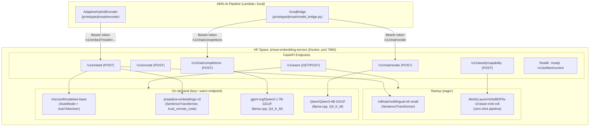
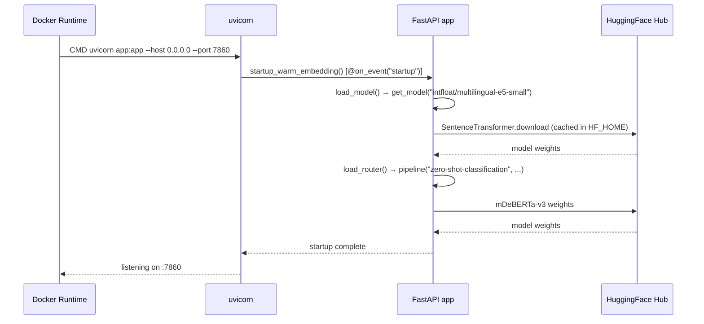
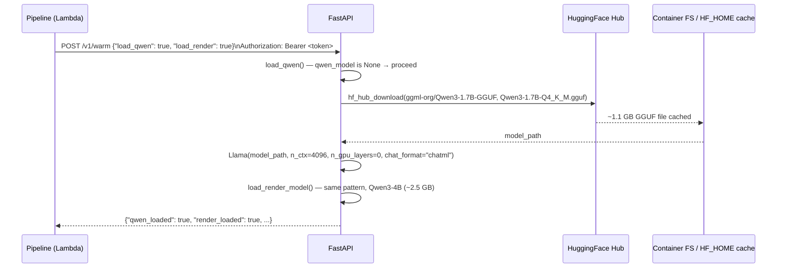
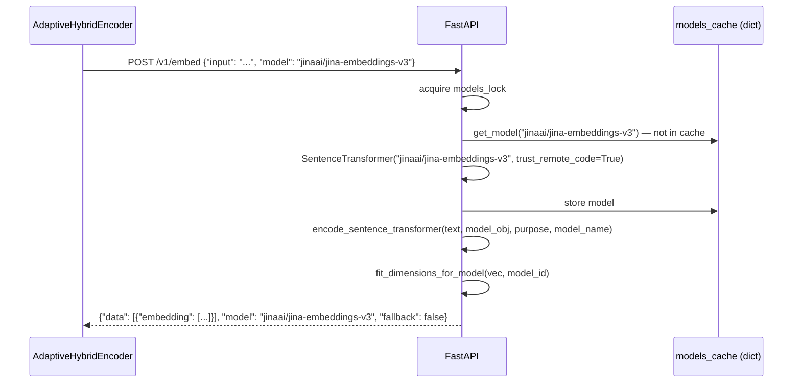
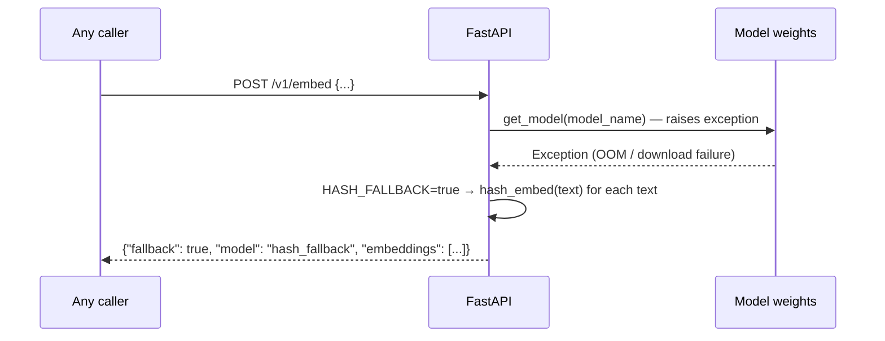
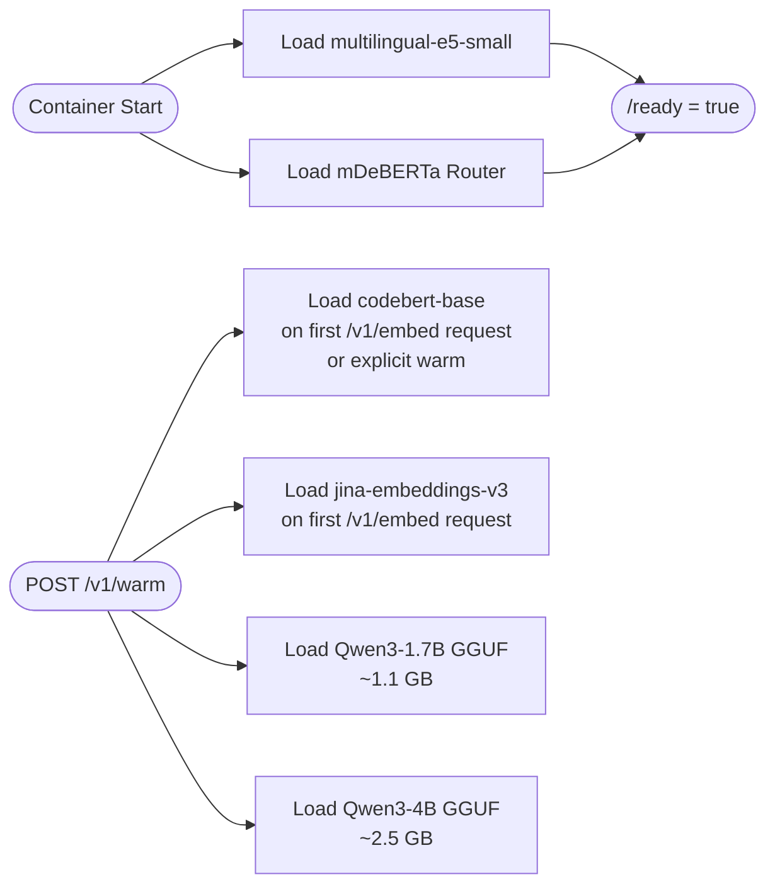

# Design Document: HuggingFace Space Model Setup

## Overview

The `jimsai-embedding-service` HuggingFace Space is the centralized inference backend for the JIMS-AI pipeline. It hosts four distinct model layers — semantic/code/technical embedding, zero-shot capability routing, T1 intent encoding (Qwen3-1.7B), and T2 render generation (Qwen3-4B) — all exposed as a single FastAPI service over Docker. This document covers the full system architecture, model loading strategy, Dockerfile layering rationale, environment variable catalog, required `requirements.txt` corrections, README structure requirements, startup/warm-up sequence, security model, and fallback behavior.

The primary goals of this spec are to ensure all four model layers are correctly configured in the HF Space infrastructure, that `requirements.txt` lists every dependency the container needs (excluding the ones the Dockerfile installs separately for correctness reasons), and that the README provides sufficient operational documentation for both the HF Space runner and downstream pipeline operators.

No changes to `app.py` are needed — it already correctly implements all model loading, endpoints, locking, and fallback logic. This spec focuses entirely on the infrastructure configuration files (`requirements.txt`, `Dockerfile`, `README.md`) and the documentation artifacts needed to operate the service.

---

## Architecture

### High-Level System Diagram



### Component Roles

| Component | Model | Role | Loading |
|-----------|-------|------|---------|
| Embedding (primary semantic) | `intfloat/multilingual-e5-small` | Dense semantic vectors for memory retrieval | Eager (startup) |
| Embedding (code) | `microsoft/codebert-base` | Code-aware embeddings via mean-pool CLS | Lazy (first `/v1/embed` call with `model=microsoft/codebert-base`) |
| Embedding (technical) | `jinaai/jina-embeddings-v3` | Technical/multilingual vectors with `trust_remote_code` | Lazy (first `/v1/embed` call with `model=jinaai/jina-embeddings-v3`) |
| Capability Router | `MoritzLaurer/mDeBERTa-v3-base-mnli-xnli` | Zero-shot classification of query kind | Eager (startup) |
| T1 Encoder / Intent | Qwen3-1.7B Q4_K_M (GGUF) | Intent inference, capability classification, math extraction | Lazy (warm endpoint or first `/v1/chat/completions`) |
| T2 Render | Qwen3-4B Q4_K_M (GGUF) | Canvas synthesis, invention candidates, NL rendering | Lazy (warm endpoint or first `/v1/chat/render`) |

---

## Sequence Diagrams

### Startup Sequence



### Lazy GGUF Load via Warm Endpoint



### Embedding Request with Model Selection



### Hash Fallback Path



---

## Components and Interfaces

### Component 1: FastAPI Application (`app.py`)

**Purpose**: Unified HTTP gateway for all four model layers. Already complete — no changes needed.

**Key Interfaces**:

```python
# Embedding request — supports both OpenAI-style "input" and legacy "texts"
class EmbedRequest(BaseModel):
    texts: list[str] | None = None
    input: str | list[str] | None = None
    model: str | None = None       # selects among e5-small, codebert-base, jina-embeddings-v3
    workspace_id: str | None = None
    purpose: str = "query"          # "query" or "passage" — affects e5-small prefix

# T1/T2 chat interface (OpenAI-compatible)
class ChatCompletionRequest(BaseModel):
    model: str | None = None
    messages: list[ChatMessage]
    temperature: float = 0.0
    max_tokens: int | None = None
    response_format: dict | None = None   # {"type": "json_object"} strips <think> tags

# Capability classification
class CapabilityClassifyRequest(BaseModel):
    text: str
    candidate_kinds: list[str] | None = None   # subset of CAPABILITY_LABELS keys
```

**Responsibilities**:
- Authenticate all protected endpoints via `verify_token()` (Bearer token from `JIMS_RENDER_AGENT_TOKEN` or `JIMS_EMBEDDING_SERVICE_TOKEN`)
- Load models lazily with module-level globals protected by `asyncio.Lock` instances
- Return hash fallback embeddings when embedding models are unavailable and `JIMS_EMBEDDING_HASH_FALLBACK_ENABLED=true`
- Strip `<think>` tags from Qwen3 output when `response_format={"type":"json_object"}` is requested
- Emit structured health / readiness state via `/health` and `/ready`

### Component 2: Model Cache (`models_cache`)

**Purpose**: In-process LRU-like dict that prevents re-loading the same embedding model on successive requests.

**Interface**:
```python
models_cache: dict[str, SentenceTransformer | tuple[AutoModel, AutoTokenizer]]
models_lock: asyncio.Lock  # guards models_cache writes
```

**Responsibilities**:
- Cache all three embedding models keyed by model ID string
- `get_model(model_name)` handles three distinct loading paths:
  - `intfloat/multilingual-e5-small` → `SentenceTransformer(model_name)`
  - `jinaai/jina-embeddings-v3` → `SentenceTransformer(model_name, trust_remote_code=True)`
  - `microsoft/codebert-base` → `(AutoModel, AutoTokenizer).from_pretrained(model_name)`
  - any other model_id → `SentenceTransformer(model_name)` (generic fallback)

### Component 3: GGUF Model Loaders (`load_qwen`, `load_render_model`)

**Purpose**: Download and instantiate the two Qwen3 GGUF models via `llama-cpp-python`.

**Loading contract**:
- Both functions are idempotent (return existing instance if already loaded)
- Both respect `JIMS_QWEN_ENABLED=false` — they return `None` and set an error string
- If `hf_hub_download` fails (network, auth), the function logs the error to `qwen_error` / `render_error` and returns `None`; the corresponding endpoint raises HTTP 503
- A hard llama.cpp assertion failure during inference (`inference_failed_hard`) resets the module-level reference to `None`, allowing a re-download on the next call

### Component 4: Capability Router (`load_router`)

**Purpose**: Wraps `MoritzLaurer/mDeBERTa-v3-base-mnli-xnli` in a `transformers.pipeline` for zero-shot classification.

**Responsibilities**:
- Always loaded on startup alongside the primary embedding model
- Uses `device=-1` (CPU-only)
- Maps free-text queries to one of 9 capability kinds: `memory_chat`, `world_knowledge`, `coding`, `math_science`, `creative_text`, `image_generation`, `audio_generation`, `video_generation`, `agentic_task`

---

## Data Models

### Embedding Response

```python
{
    "object": "list",
    "data": [{"object": "embedding", "index": int, "embedding": list[float]}],
    "model": str,          # actual model used (or "hash_fallback")
    "artifact_id": str,    # JIMS_ACTIVE_ARTIFACT_ID
    "dimension": int,      # length of embedding vectors
    "vectors": list[list[float]],    # alias for data[*].embedding
    "embeddings": list[list[float]], # alias
    "fallback": bool,      # true when hash_embed was used
    "error": str,          # non-empty only when fallback=true
}
```

### Chat Completion Response (T1 and T2)

```python
{
    "id": str,             # "chatcmpl-{uuid}"
    "object": "chat.completion",
    "created": int,        # unix timestamp
    "model": str,
    "choices": [{
        "index": 0,
        "message": {"role": "assistant", "content": str},
        "finish_reason": str,
    }],
    "usage": dict,         # token counts from llama-cpp
}
```

### Capability Classification Response

```python
{
    "model": str,                     # ROUTER_MODEL_NAME
    "primary_kind": str,              # top-scoring capability kind
    "confidence": float,              # score of primary_kind
    "secondary_kinds": list[str],     # up to 3 secondary kinds with score ≥ 0.35
    "scores": [{"kind": str, "score": float}],  # full ranked list
}
```

---

## Environment Variable Configuration

All variables are read at module-level in `app.py`. Safe to set as HF Space secrets or environment variables.

### Authentication

| Variable | Default | Required | Description |
|----------|---------|----------|-------------|
| `JIMS_RENDER_AGENT_TOKEN` | — | **Yes (one of the two)** | Bearer token for all protected endpoints. Takes precedence over `JIMS_EMBEDDING_SERVICE_TOKEN`. |
| `JIMS_EMBEDDING_SERVICE_TOKEN` | `""` | Yes (one of the two) | Fallback token variable. Either this or `JIMS_RENDER_AGENT_TOKEN` must be non-empty or all protected endpoints return HTTP 503. |

### Embedding Layer

| Variable | Default | Description |
|----------|---------|-------------|
| `JIMS_EMBEDDING_MODEL` | `intfloat/multilingual-e5-small` | Primary model loaded on startup. Determines default for `/v1/embed` when no `model` param is passed. |
| `JIMS_EMBEDDING_DIMENSIONS` | `768` | Target output dimension. Vectors are truncated/zero-padded to match. Must be ≥ 1. |
| `JIMS_EMBEDDING_HASH_FALLBACK_ENABLED` | `true` | When `true`, failed embeddings return deterministic hash vectors instead of HTTP 503. |
| `JIMS_ACTIVE_ARTIFACT_ID` | `hf_space_encoder` | Identifier echoed back in embedding responses for tracing. |

### T1 Encoder (Qwen3-1.7B)

| Variable | Default | Description |
|----------|---------|-------------|
| `JIMS_QWEN_ENABLED` | `true` | Set to `false` to disable Qwen3 loading entirely (reduces memory, disables `/v1/chat/completions`). |
| `JIMS_QWEN_MODEL_REPO` | `ggml-org/Qwen3-1.7B-GGUF` | HuggingFace repo ID for the GGUF file. |
| `JIMS_QWEN_MODEL_FILE` | `Qwen3-1.7B-Q4_K_M.gguf` | Filename within the repo. ~1.1 GB download. |
| `JIMS_QWEN_MODEL` | `qwen3-1.7b-instruct` | Model name echoed in chat completion responses. |
| `JIMS_QWEN_CONTEXT` | `4096` | Context window in tokens. Minimum 512. |
| `JIMS_QWEN_MAX_TOKENS` | `256` | Maximum output tokens for intent/classification tasks. |
| `JIMS_QWEN_THREADS` | `2` | CPU threads for llama-cpp inference. |
| `JIMS_QWEN_BATCH` | `64` | Batch size for prompt processing. |
| `JIMS_QWEN_CHAT_FORMAT` | `chatml` | llama-cpp chat format template. |

### T2 Render (Qwen3-4B)

| Variable | Default | Description |
|----------|---------|-------------|
| `JIMS_RENDER_MODEL_REPO` | `Qwen/Qwen3-4B-GGUF` | HuggingFace repo ID for render GGUF. |
| `JIMS_RENDER_MODEL_FILE` | `Qwen3-4B-Q4_K_M.gguf` | Filename within the repo. ~2.5 GB download. |
| `JIMS_RENDER_MODEL_NAME` | `qwen3-4b-instruct` | Model name echoed in render responses. |
| `JIMS_RENDER_CONTEXT` | `8192` | Context window for render tasks (larger for canvas/ingestion). |
| `JIMS_RENDER_MAX_TOKENS` | `1200` | Maximum output tokens for render/canvas/ingestion tasks. |
| `JIMS_RENDER_THREADS` | `2` | CPU threads for render inference. |
| `JIMS_RENDER_BATCH` | `128` | Batch size for render prompt processing. |

### Capability Router

| Variable | Default | Description |
|----------|---------|-------------|
| `JIMS_ROUTER_MODEL` | `MoritzLaurer/mDeBERTa-v3-base-mnli-xnli` | Zero-shot classification model. Loaded eagerly on startup. |

### HuggingFace Access

| Variable | Default | Description |
|----------|---------|-------------|
| `HF_TOKEN` | — | HF access token. Used for `hf_hub_download` of GGUF files. Also checked as `HUGGINGFACE_HUB_TOKEN`, `HUGGING_ACCESS_TOKEN`, `HUGGING_ACESS_TOKEN` (typo variant preserved). Required if either Qwen GGUF repo requires authentication. |

---

## Dockerfile Layering Rationale

The Dockerfile installs `torch` and `llama-cpp-python` **before** `requirements.txt` deliberately. This is the correct design and must not be changed.

```dockerfile
# Layer 1: system libs (libgomp1 for llama-cpp OpenMP)
RUN apt-get install -y --no-install-recommends libgomp1

# Layer 2: torch CPU wheel (separate index URL)
RUN pip install torch --index-url https://download.pytorch.org/whl/cpu

# Layer 3: llama-cpp-python CPU wheel (separate index URL)
RUN pip install llama-cpp-python --extra-index-url https://abetlen.github.io/llama-cpp-python/whl/cpu

# Layer 4: application dependencies (standard PyPI)
RUN pip install -r requirements.txt
```

**Why this order is required**:

1. **`torch` must come before `sentence-transformers` and `transformers`**: Both `sentence-transformers` and `transformers` will attempt to install `torch` themselves if it is not already present. Allowing PyPI to resolve `torch` would pull the CUDA-enabled wheel (~2.5 GB) instead of the CPU-only wheel (~250 MB), bloating the image by ~2 GB. Installing torch first with the explicit CPU index URL locks the correct variant before requirements.txt runs.

2. **`llama-cpp-python` must come before `requirements.txt`**: The pre-built CPU wheel at `abetlen.github.io/llama-cpp-python/whl/cpu` avoids compiling llama.cpp from source (which requires `cmake`, `g++`, and ~10 minutes of build time). If `llama-cpp-python` were listed in `requirements.txt`, pip would find no matching wheel at PyPI and fall back to source compilation. The Dockerfile ensures the pre-built binary wheel is installed first, and requirements.txt does not re-install it.

3. **Docker layer caching**: Separating heavy, infrequently-changing deps (`torch`, `llama-cpp-python`) from the application-level `requirements.txt` means that updating Python deps (e.g., bumping `fastapi` version) only invalidates Layer 4, not the multi-GB torch/llama layers.

4. **`libgomp1`**: Required at the system level for OpenMP threading used by llama-cpp-python. Must be installed before the llama-cpp Python layer.

**Consequence for `requirements.txt`**: `torch` and `llama-cpp-python` must **not** be listed in `requirements.txt`. Adding them there would either be a no-op (if already installed) or cause pip to attempt a re-install from PyPI, potentially pulling the wrong variant.

---

## `requirements.txt` Corrections

### Current State (incomplete)

```
fastapi
uvicorn[standard]
sentence-transformers
transformers
numpy
pydantic
python-dotenv
huggingface-hub
```

### Required State

```
fastapi
uvicorn[standard]
sentence-transformers
transformers
numpy
pydantic
python-dotenv
huggingface-hub
httpx
accelerate
einops
```

### Missing Dependencies Explained

| Package | Why Needed |
|---------|-----------|
| `httpx` | Used by `AdaptiveHybridEncoder._fetch_remote_vector` in `prototype/jimsai/encoder/adaptive_hybrid_encoder.py` for remote embedding calls. Also used throughout `model_bridge.py` (`GroqBridge._local_chat_json`). The service container itself does not call out, but if any test or utility runs in the container context it will fail without it. More critically, `httpx` may be imported at module load time in downstream code bundled into the space. |
| `accelerate` | Required by `transformers` when loading large models on CPU with device_map. `mDeBERTa-v3-base-mnli-xnli` and `codebert-base` may trigger an `accelerate` import when `AutoModel.from_pretrained` runs. Without it, certain model variants raise `ImportError: Using `low_cpu_mem_usage=True` or a `device_map` requires Accelerate`. |
| `einops` | Required by `jinaai/jina-embeddings-v3`. The Jina v3 model code (loaded via `trust_remote_code=True`) uses `einops` for tensor rearrangement operations. Without it, `SentenceTransformer("jinaai/jina-embeddings-v3", trust_remote_code=True)` raises `ModuleNotFoundError: No module named 'einops'`. |

### What Must NOT Be in `requirements.txt`

- `torch` — installed separately in Dockerfile Layer 2 with CPU-only index
- `llama-cpp-python` — installed separately in Dockerfile Layer 3 with pre-built CPU wheel

---

## README Structure Requirements

The README serves two audiences: the HF Space infrastructure (the YAML front matter controls Space behavior) and pipeline operators who need to configure and operate the service. The following sections are required:

### 1. HF Space YAML Front Matter (preserve exactly)

```yaml
---
title: jimsai-embedding-service
emoji: 🤖
colorFrom: blue
colorTo: green
sdk: docker
app_port: 7860
---
```

This is correct and must not be changed. `sdk: docker` instructs HF Spaces to use the Dockerfile. `app_port: 7860` must match the `--port 7860` in the Dockerfile CMD.

### 2. Model Cards Section

Document all four model layers with:
- Model name (linked to HF model card)
- Role in the pipeline
- Download size (approximate)
- Loading strategy (eager vs lazy)
- Key parameters (context, max tokens, etc.)

**Required entries**:

| # | Model | Role | Size | Load |
|---|-------|------|------|------|
| 1 | `intfloat/multilingual-e5-small` | Primary semantic embeddings | ~120 MB | Eager (startup) |
| 2 | `microsoft/codebert-base` | Code-aware embeddings | ~500 MB | Lazy |
| 3 | `jinaai/jina-embeddings-v3` | Technical/multilingual embeddings | ~570 MB | Lazy |
| 4 | `MoritzLaurer/mDeBERTa-v3-base-mnli-xnli` | Capability classification (zero-shot) | ~560 MB | Eager (startup) |
| 5 | `ggml-org/Qwen3-1.7B-GGUF` / `Qwen3-1.7B-Q4_K_M.gguf` | T1 intent encoder | ~1.1 GB | Lazy |
| 6 | `Qwen/Qwen3-4B-GGUF` / `Qwen3-4B-Q4_K_M.gguf` | T2 render engine | ~2.5 GB | Lazy |

### 3. Hardware Requirements Section

Document:
- Minimum: CPU Space with ≥ 16 GB RAM (for all models loaded simultaneously)
- Recommended: CPU Space with 32 GB RAM (comfortable headroom for all models + OS)
- No GPU required — all models run on CPU (`n_gpu_layers=0`, `device=-1`)
- Disk: ≥ 6 GB free for model cache (`HF_HOME`)
- Note: Startup time with eager models only (~2–3 min cold start). Full warm with both Qwen models: ~8–12 min cold start (GGUF download + load).

### 4. Environment Variables Table

Full table of all variables from the configuration section above, with columns: Variable, Default, Required, Description. Must include the auth token note: if neither `JIMS_RENDER_AGENT_TOKEN` nor `JIMS_EMBEDDING_SERVICE_TOKEN` is set, all protected endpoints return HTTP 503 (not 401 — the service refuses to operate without a token rather than accepting unauthenticated requests).

### 5. Startup and Warm-Up Instructions

Document the two-phase startup:

**Phase 1 — Automatic on container start** (no action needed):
- `intfloat/multilingual-e5-small` loads via `startup_warm_embedding()`
- `MoritzLaurer/mDeBERTa-v3-base-mnli-xnli` loads via `startup_warm_embedding()`
- Verify via `GET /ready` — returns `{"ready": true}` when both are loaded

**Phase 2 — Manual warm-up** (call after `/ready` returns true):
```
POST /v1/warm
Authorization: Bearer <token>
{"load_qwen": true, "load_render": true}
```
Or via GET:
```
GET /v1/warm?load_qwen_model=true&load_render_model=true
Authorization: Bearer <token>
```

Document that warm-up is optional but strongly recommended before any production traffic hits `/v1/chat/completions` or `/v1/chat/render`, because the first cold request will block for the full GGUF download + load time (~60–120 seconds per model).

### 6. Endpoint Reference

Full table of endpoints:

| Method | Path | Auth | Description |
|--------|------|------|-------------|
| GET | `/` | No | Service identity check |
| GET | `/health` | No | Full model status (loaded/not, error strings) |
| GET | `/ready` | No | `true` when embedding + router are loaded |
| GET/POST | `/v1/warm` | **Yes** | Trigger model pre-loading |
| POST | `/v1/embed` | **Yes** | Embed texts; `model` param selects embedding model |
| POST | `/v1/embed-batch` | **Yes** | Alias for `/v1/embed` |
| POST | `/v1/encode` | **Yes** | Single-text encode (legacy interface) |
| POST | `/v1/chat/completions` | **Yes** | T1 intent inference via Qwen3-1.7B |
| POST | `/v1/chat/render` | **Yes** | T2 render via Qwen3-4B |
| POST | `/v1/classify/capability` | **Yes** | Zero-shot capability routing |
| GET | `/v1/artifact/current` | No | Current artifact/model configuration |
| POST | `/v1/reload-artifact` | **Yes** | Reload primary embedding model |

Document the `/v1/embed` `model` parameter: pass `model` in the request body to select which of the three embedding models to use. Examples:
- `{"input": "...", "model": "intfloat/multilingual-e5-small"}` (default)
- `{"input": "...", "model": "microsoft/codebert-base"}`
- `{"input": "...", "model": "jinaai/jina-embeddings-v3"}`

### 7. Client Configuration (Lambda / downstream)

Document the env vars the Lambda/pipeline side must set:

```
JIMS_LLM_PROVIDER=local
JIMS_ENABLE_LOCAL_QWEN=true
JIMS_LOCAL_INFERENCE_URL=https://jimstechai-jimsai-embedding-service.hf.space
JIMS_LOCAL_INFERENCE_API_KEY=<same token as JIMS_RENDER_AGENT_TOKEN>
JIMS_LOCAL_INFERENCE_MODEL=qwen3-1.7b-instruct
JIMS_LOCAL_INFERENCE_CHAT_PATH=/v1/chat/completions
JIMS_LOCAL_RENDER_MODEL=qwen3-4b-instruct
JIMS_LOCAL_RENDER_CHAT_PATH=/v1/chat/render
JIMS_EMBEDDING_SERVICE_URL=https://jimstechai-jimsai-embedding-service.hf.space
JIMS_EMBEDDING_SERVICE_TOKEN=<same token>
```

### 8. Known Limitations

- **CPU-only**: All inference runs on CPU. Qwen3-4B render tasks may take 15–45 seconds per response depending on output length and Space CPU allocation.
- **No concurrent GGUF inference**: `qwen_lock` and `render_lock` serialize all calls to the respective Qwen models. High request rates will queue.
- **Cold start delay**: HF Spaces may idle and spin down the container. First request after idle triggers a full cold start including GGUF re-download from cache (fast if `HF_HOME` is persisted) or re-download from Hub (slow).
- **Jina v3 `trust_remote_code`**: Loading this model executes code from the model repository. Reviewed and safe for production use, but requires explicit acknowledgment.
- **`JIMS_QWEN_ENABLED=false`**: Disabling Qwen disables both T1 and T2 (both check the same flag). If only T2 should be disabled, it must be done by not calling the warm endpoint for render.
- **Hash fallback vectors**: When embedding models fail, hash fallback vectors are deterministic but not semantically meaningful. Retrieval quality degrades significantly. Monitor `fallback: true` in embedding responses.

---

## Model Loading Strategy

### Loading Classification



### Locking Strategy

- `models_lock` (asyncio.Lock): Guards `models_cache` dict writes. Prevents two concurrent requests from loading the same embedding model simultaneously. Acquired per `/v1/embed` and `/v1/encode` call.
- `qwen_lock` (asyncio.Lock): Serializes all `/v1/chat/completions` requests. llama-cpp-python is not thread-safe; concurrent calls would corrupt model state.
- `render_lock` (asyncio.Lock): Same pattern for `/v1/chat/render`.
- Module-level globals (`qwen_model`, `render_model`, etc.) are safe within the lock but should not be accessed outside of it during load.

### Fallback Decision Tree

```mermaid
graph TD
    A[/v1/embed request] --> B{models_cache hit?}
    B -- Yes --> C[encode with cached model]
    B -- No --> D[get_model call]
    D --> E{Download/load success?}
    E -- Yes --> F[store in cache, encode]
    E -- No --> G{HASH_FALLBACK=true?}
    G -- Yes --> H[hash_embed deterministic vectors\nfallback=true in response]
    G -- No --> I[raise HTTP 503]
```

---

## Security

### Token Authentication

- All endpoints that mutate state or return model output require `Authorization: Bearer <token>`
- Token is compared against `JIMS_RENDER_AGENT_TOKEN` (preferred) or `JIMS_EMBEDDING_SERVICE_TOKEN`
- If **neither** variable is set: `verify_token()` raises HTTP 503 (`"agent token not configured"`). The service deliberately refuses to operate without a token rather than defaulting to open access.
- If the token is wrong: HTTP 401 (`"invalid token"`)
- Unauthenticated endpoints (GET only, no model output): `/`, `/health`, `/ready`, `/v1/artifact/current`

### Threat Model

| Threat | Mitigation |
|--------|-----------|
| Unauthorized inference calls | Bearer token required on all POST endpoints |
| Token brute-force | HF Space rate limiting; token should be a random UUID or high-entropy string |
| Model exfiltration | Models are cached to `HF_HOME` inside the container, not exposed directly |
| Prompt injection via `json_object` format | `strip_thinking_for_json` removes `<think>` blocks before returning; input is length-capped at 16000 chars for embeddings, 4096 for classifier |
| Container privilege escalation | App runs as `user` (uid 1000), not root |

---

## Testing Strategy

### Unit Testing Approach

- Test `hash_embed` determinism: same input always produces same output
- Test `fit_dimensions` / `fit_dimensions_for_model`: verify truncation and zero-padding to `TARGET_DIMENSIONS`
- Test `strip_thinking_for_json`: verify `<think>` block removal and JSON extraction
- Test `normalize`: verify output has L2 norm ≈ 1.0
- Test `inference_failed_hard`: verify string matching for hard failure patterns
- Test `verify_token`: confirm 401 on wrong token, 503 on unconfigured token
- Test `get_model` dispatch: verify correct loader is selected for each model ID

### Property-Based Testing Approach

**Property test library**: `hypothesis`

- **Hash embedding consistency**: For any non-empty string `s`, `hash_embed(s)` has length == `TARGET_DIMENSIONS` and L2 norm ≈ 1.0
- **Dimension fitting**: For any float list `v` with `len(v) != TARGET_DIMENSIONS`, `fit_dimensions(v)` returns a list of length exactly `TARGET_DIMENSIONS`
- **Token auth idempotency**: For any valid token string `t`, calling `verify_token` with `t` against a service configured with `t` always succeeds; for any token `t2 != t`, it always fails
- **JSON stripping**: For any string containing `<think>...</think>` followed by a JSON object, `strip_thinking_for_json` returns valid JSON

### Integration Testing Approach

- Cold-start test: verify `/ready` transitions from `false` to `true` after startup
- Embedding round-trip: call `/v1/embed` with each of the three model IDs, verify dimension and non-zero vector
- Fallback test: with `JIMS_EMBEDDING_HASH_FALLBACK_ENABLED=true` and an invalid model name, verify `fallback=true` in response
- Capability classification: call `/v1/classify/capability` with test inputs from each of the 9 capability kinds, verify `primary_kind` is in the allowed set
- Token rejection: call protected endpoint without token, verify 403; with wrong token, verify 401

---

## Performance Considerations

- **Startup time**: Eager loading of `multilingual-e5-small` and `mDeBERTa-v3` adds ~90–180 seconds to cold start. This is acceptable for a long-running Space; HF Spaces should have liveness probes pointing to `/health` rather than a startup probe.
- **Embedding throughput**: `sentence-transformers` on CPU can handle ~50–100 short texts/second for `multilingual-e5-small`. Batching via `/v1/embed-batch` is equivalent to `/v1/embed` (same handler); true batch encoding is not currently implemented in `embed_texts()` — each text is encoded individually in a loop. This is a known limitation for high-throughput scenarios.
- **GGUF inference latency**: Qwen3-1.7B at Q4_K_M on CPU with 2 threads produces ~256 tokens in 15–30 seconds. Qwen3-4B produces 1200 tokens in 45–90 seconds. Both models use `asyncio.Lock` to serialize requests.
- **Memory footprint** (all models loaded):
  - `multilingual-e5-small`: ~120 MB
  - `codebert-base`: ~500 MB
  - `jina-embeddings-v3`: ~570 MB
  - `mDeBERTa-v3-base-mnli-xnli`: ~560 MB
  - `Qwen3-1.7B-Q4_K_M.gguf`: ~1.1 GB
  - `Qwen3-4B-Q4_K_M.gguf`: ~2.5 GB
  - **Total**: ~5.4 GB model weights + OS/Python overhead → 16 GB minimum RAM, 32 GB recommended

---

## Correctness Properties

*A property is a characteristic or behavior that should hold true across all valid executions of a system — essentially, a formal statement about what the system should do. Properties serve as the bridge between human-readable specifications and machine-verifiable correctness guarantees.*

### Property 1: Embedding dimension and normalization invariant

For any input text and any supported embedding model (`intfloat/multilingual-e5-small`, `microsoft/codebert-base`, `jinaai/jina-embeddings-v3`), the returned embedding vector must have length exactly equal to `TARGET_DIMENSIONS` and an L2 norm within `1e-5` of 1.0: `∀ text, model: len(embed(text, model)) == TARGET_DIMENSIONS ∧ |‖embed(text, model)‖ − 1.0| < 1e-5`.

**Validates: Requirements 1.1, 1.2, 1.3, 1.5**

### Property 2: Dimension-fitting correctness

For any float list `v` of arbitrary length, `fit_dimensions(v)` returns a list of length exactly `TARGET_DIMENSIONS`. When `len(v) > TARGET_DIMENSIONS` the result is a truncated prefix; when `len(v) < TARGET_DIMENSIONS` the result is zero-padded. The result is always L2-normalized.

**Validates: Requirements 1.5**

### Property 3: Hash fallback determinism

For any input text `s`, `hash_embed(s)` returns an identical vector on every invocation: `∀ s: hash_embed(s) == hash_embed(s)`. The output vector has length `TARGET_DIMENSIONS` and L2 norm ≈ 1.0.

**Validates: Requirements 2.4**

### Property 4: Fallback transparency

For any embedding request, the `fallback` and `model` response fields accurately reflect whether hash fallback was used. When hash fallback is active: `response.fallback == true ∧ response.model == "hash_fallback"`. When a real model succeeds: `response.fallback == false ∧ response.model == actual_model_id`.

**Validates: Requirements 2.1, 2.5**

### Property 5: Token authentication correctness

For any configured token string `t` and any candidate token `t2`: if `t2 == t` then `verify_token(t2)` succeeds; if `t2 != t` then `verify_token(t2)` raises HTTP 401. This holds for all non-empty string pairs.

**Validates: Requirements 8.1, 8.2**

### Property 6: Think-block stripping

For any string containing one or more `<think>...</think>` blocks followed by a JSON object, `strip_thinking_for_json` returns a string that contains no `<think>` or `</think>` tags and is valid JSON. `∀ s with <think> blocks: strip_thinking_for_json(s)` is valid JSON with all think blocks removed.

**Validates: Requirements 3.2, 4.2**

### Property 7: Chat completion response structure

For any valid message list sent to `/v1/chat/completions` or `/v1/chat/render` when the respective model is loaded, the response must contain all required OpenAI-compatible fields: `id`, `object`, `created`, `model`, `choices[0].message.content`, and `usage`.

**Validates: Requirements 3.1, 4.1**

### Property 8: Readiness state consistency

The `/ready` endpoint returns `{"ready": true}` if and only if both `model` (embedding) and `router_model` (capability router) are non-`None`. For any combination of load states: `ready() == (model is not None ∧ router_model is not None)`.

**Validates: Requirements 9.3**

### Property 9: Load function idempotency

For any `load_*` function (`load_qwen`, `load_render_model`, `load_router`, `load_model`) called when the corresponding module-level variable is already non-`None`, the function returns the existing instance without invoking `hf_hub_download` or any model constructor. `∀ loaded_model ≠ None: load_fn() returns same instance`.

**Validates: Requirements 9.6**

### Property 10: Capability classification range

For any input text, the `primary_kind` field in a `/v1/classify/capability` response is always one of the nine defined capability kinds: `{memory_chat, world_knowledge, coding, math_science, creative_text, image_generation, audio_generation, video_generation, agentic_task}`. No other value is ever returned.

**Validates: Requirements 5.4**

---

## Error Handling

### Scenario 1: Embedding Model Unavailable

**Condition**: `get_model(model_name)` raises an exception (network failure, OOM, corrupt weights).

**Response**:
- If `JIMS_EMBEDDING_HASH_FALLBACK_ENABLED=true`: Return HTTP 200 with `fallback=true`, `model="hash_fallback"`, deterministic hash vectors. `error` field contains the exception message.
- If `JIMS_EMBEDDING_HASH_FALLBACK_ENABLED=false`: Raise HTTP 503 `"embedding model unavailable: <exc>"`.

**Recovery**: On the next request, `get_model` will retry loading (no backoff currently implemented). If the underlying cause was transient (e.g., network timeout), the next call may succeed and populate the cache.

### Scenario 2: GGUF Model Unavailable (T1 or T2)

**Condition**: `hf_hub_download` fails or `Llama(...)` constructor raises during `load_qwen()` / `load_render_model()`.

**Response**: Function returns `None`, sets `qwen_error` / `render_error` to the exception string. The endpoint (`/v1/chat/completions` or `/v1/chat/render`) raises HTTP 503 `"qwen model unavailable: <error>"`.

**Recovery**: Call `POST /v1/warm {"load_qwen": true}` after resolving the underlying issue (e.g., setting `HF_TOKEN` for gated repos, freeing memory).

### Scenario 3: GGUF Inference Hard Failure

**Condition**: `llama-cpp` internal assertion fails during inference (`inference_failed_hard` returns true — detects "ggml_assert", "assert", "failed", "repack" in exception string).

**Response**: HTTP 500 `"qwen inference failed: <exc>"`. Module-level `qwen_model` / `render_model` is reset to `None`.

**Recovery**: Next call to the endpoint will trigger `load_qwen()` / `load_render_model()` again automatically, re-downloading and re-initializing the model.

### Scenario 4: Router Model Unavailable

**Condition**: `load_router()` fails (transformers pipeline error, OOM).

**Response**: `router_error` is set. `/v1/classify/capability` returns HTTP 503 `"router model unavailable: <error>"`. Embedding endpoints are unaffected.

**Recovery**: Call `POST /v1/warm {"load_router": true}` to retry.

### Scenario 5: No Auth Token Configured

**Condition**: Neither `JIMS_RENDER_AGENT_TOKEN` nor `JIMS_EMBEDDING_SERVICE_TOKEN` is set in the environment.

**Response**: `verify_token()` raises HTTP 503 `"agent token not configured"` on all protected endpoints. This is intentional — the service refuses to serve inference without a token, preventing accidental open access.

**Recovery**: Set `JIMS_RENDER_AGENT_TOKEN` as a HF Space secret and restart/redeploy.

### Scenario 6: Invalid/Missing Auth Token

**Condition**: Caller provides a `Bearer` token that does not match the configured token.

**Response**: HTTP 401 `"invalid token"`.

**Recovery**: Use the correct token from the HF Space secret.

### Scenario 7: Jina v3 `trust_remote_code` Failure

**Condition**: `jina-embeddings-v3` model code fails to load (e.g., `einops` not installed, remote code changed, network issue).

**Response**: Caught by `embed_texts` exception handler. With hash fallback enabled, returns hash vectors with `fallback=true`. Without hash fallback, returns HTTP 503.

**Recovery**: Ensure `einops` is in `requirements.txt` and the container is rebuilt. If the remote model code has changed incompatibly, pin `sentence-transformers` to a known-good version.

---

## Dependencies

### Python Dependencies (via `requirements.txt`)

| Package | Version constraint | Purpose |
|---------|-------------------|---------|
| `fastapi` | latest stable | HTTP framework |
| `uvicorn[standard]` | latest stable | ASGI server |
| `sentence-transformers` | latest stable | `multilingual-e5-small`, `jina-embeddings-v3` |
| `transformers` | latest stable | `codebert-base`, `mDeBERTa-v3` pipeline |
| `numpy` | latest stable | Embedding math, fallback fusion |
| `pydantic` | latest stable | Request/response models |
| `python-dotenv` | latest stable | `.env` file support in dev |
| `huggingface-hub` | latest stable | `hf_hub_download` for GGUF files |
| `httpx` | latest stable | Remote embedding calls (AdaptiveHybridEncoder remote mode) |
| `accelerate` | latest stable | Required by transformers for CPU model loading with `device_map` |
| `einops` | latest stable | Required by `jina-embeddings-v3` remote code |

### Dockerfile System Dependencies

| Package | Layer | Purpose |
|---------|-------|---------|
| `libgomp1` | apt | OpenMP threading for llama-cpp-python |
| `torch` (CPU wheel) | pip (before requirements.txt) | PyTorch CPU for sentence-transformers and codebert |
| `llama-cpp-python` (CPU wheel) | pip (before requirements.txt) | GGUF model inference for Qwen3 models |

### External Services

| Service | URL | Purpose |
|---------|-----|---------|
| HuggingFace Hub | `huggingface.co` | Model weight downloads on first load |
| HF Spaces runtime | — | Container hosting, port 7860, `HF_HOME` cache |
