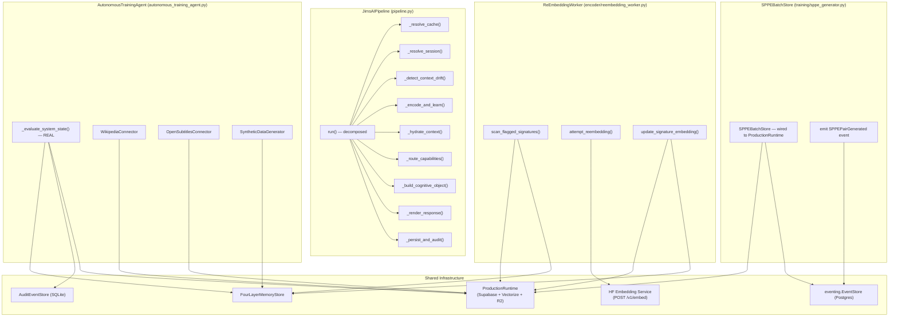
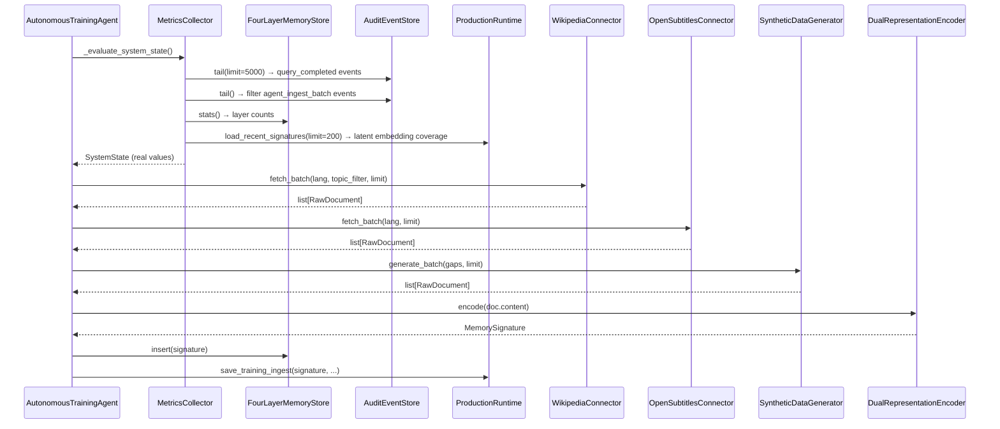
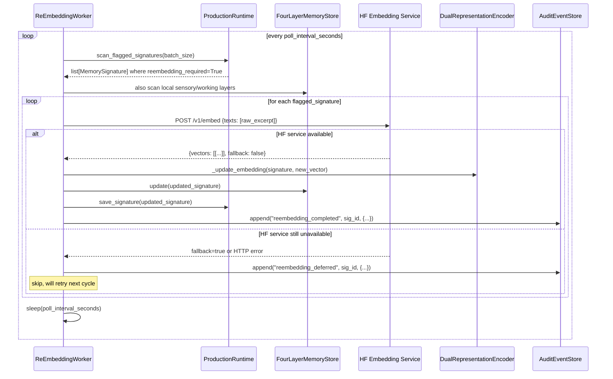
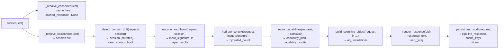
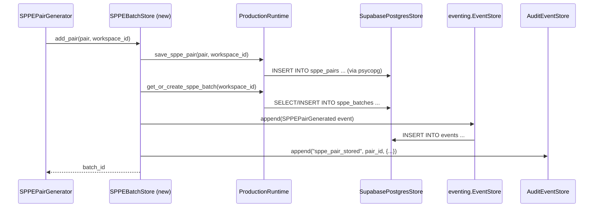

# Design Document: JIMS-AI Architectural Gap Fixes

## Overview

This document covers the technical design for fixing four identified architectural gaps in the JIMS-AI system. The gaps span four different subsystems: the Autonomous Training Agent (stub metrics/connectors), the re-embedding pipeline (no background worker to close the loop), the `JimsAIPipeline.run()` method (monolithic and untestable), and the `SPPEBatchStore` (isolated raw-SQL store disconnected from `ProductionRuntime` and the eventing module).

Each gap is self-contained but shares common infrastructure: `ProductionRuntime` (Supabase + Cloudflare Vectorize), `AuditEventStore` (SQLite CQRS log), `FourLayerMemoryStore` (in-memory), and the external HuggingFace embedding service. The fixes are designed to be minimally invasive — they wire up existing, already-correct infrastructure rather than introducing new persistence layers.

---

## Architecture

### System-Level Component Map



---

## Gap 1 — Autonomous Training Agent: Real Metrics & Data Connectors

### Problem Summary

`_evaluate_system_state()` returns hardcoded `SystemState` values (e.g. `intent_stability_score=0.88`). `_ingest_source()` simulates ingestion with `int(batch_size * 0.95)` math. No actual document fetching occurs for Wikipedia, OpenSubtitles, or synthetic generation.

### Architecture



### Components and Interfaces

#### MetricsCollector

Extracts real `SystemState` from live pipeline telemetry.

```python
class MetricsCollector:
    def __init__(
        self,
        memory: FourLayerMemoryStore,
        event_store: AuditEventStore,
        production: ProductionRuntime,
    ) -> None: ...

    def collect(self) -> SystemState:
        """
        Derive metrics from live data sources.

        intent_stability_score:
            Pull last N query_completed events from AuditEventStore.
            Compute fraction where confidence >= 0.72 across all
            language-tagged excerpts (use abstraction_tags on signatures).
            
        provider_dependency_rate:
            Count query_completed events where used_groq=True divided
            by total query_completed count in the rolling window.
            
        retrieval_accuracy:
            Among query_completed events, ratio where
            len(sources) >= 1 AND confidence >= 0.80.
            
        world_model_confidence_avg:
            Average confidence.score across all semantic-layer signatures
            in FourLayerMemoryStore.
            
        language_variant_scores:
            Group signatures by detected language tag.
            Score = (signatures with confidence >= 0.72) / total per lang.
            
        domain_coverage:
            Group signatures by abstraction_tags matching known domain
            keywords. Score = min(count / DOMAIN_COVERAGE_TARGET, 1.0).
            
        capability_coverage:
            From query_completed events, group by capability_kind field
            in payload. Score = verified_count / total_count per kind.
        """
```

**Preconditions:**
- `event_store` has been appending `query_completed` events during pipeline operation
- `memory` is a live `FourLayerMemoryStore` instance

**Postconditions:**
- Returns `SystemState` with no hardcoded values
- All float fields derived from real data; defaults to 0.0 if no data exists

#### Data Source Connectors

##### `WikipediaConnector`

```python
@dataclass
class RawDocument:
    source: str          # "wikipedia", "opensubtitles", "synthetic"
    lang: str            # ISO 639-1 code
    title: str
    content: str         # Unicode NFKC normalized
    metadata: dict[str, Any]

class WikipediaConnector:
    BASE_URL = "https://en.wikipedia.org/w/api.php"

    def fetch_batch(
        self,
        lang: str = "en",
        topic_filter: str | None = None,
        limit: int = 50,
    ) -> list[RawDocument]:
        """
        Fetch Wikipedia articles via the MediaWiki API.
        Uses action=query&list=random for discovery.
        Falls back gracefully on HTTP errors (returns empty list).
        Normalizes content with unicodedata.normalize("NFKC", ...).
        """
```

**Key implementation notes:**
- Use `httpx` (already in the project dependencies) with a 10s timeout
- `lang` maps to `{lang}.wikipedia.org/w/api.php`
- Request `prop=extracts&exintro=true` for concise text
- Limit content to 2000 characters per article to control embedding cost
- Add retry with exponential backoff (max 3 attempts)

##### `OpenSubtitlesConnector`

```python
class OpenSubtitlesConnector:
    BASE_URL = "https://api.opensubtitles.com/api/v1"

    def __init__(self, api_key: str | None = None) -> None:
        self.api_key = api_key or os.getenv("OPENSUBTITLES_API_KEY", "")

    def fetch_batch(
        self,
        lang: str = "en",
        limit: int = 50,
    ) -> list[RawDocument]:
        """
        Search for subtitle files via the OpenSubtitles REST API.
        Requires OPENSUBTITLES_API_KEY env var.
        Returns empty list if API key not configured (graceful degradation).
        Downloads subtitle text and extracts clean dialogue lines.
        Skips timestamps and formatting markers (<i>, {...}, etc.).
        """
```

**Key implementation notes:**
- When `api_key` is empty, log a warning and return `[]` — never crash
- Parse `.srt` content by stripping sequence numbers, timestamps (`\d+:\d+:\d+,\d+`), and HTML tags
- Limit to 20 lines per subtitle file, joined with newline

##### `SyntheticDataGenerator`

```python
class SyntheticDataGenerator:
    def generate_batch(
        self,
        gaps: list[IdentifiedGap],
        limit: int = 100,
    ) -> list[RawDocument]:
        """
        Generate synthetic Q&A pairs targeting identified gaps.
        Uses template-based generation (no external model call).
        
        For capability gaps: generates queries matching the capability
        domain with templated correct responses.
        For language gaps: generates simple factual statements in the
        target language using a small built-in phrase template bank.
        For domain gaps: generates structured factoid sentences about
        the domain using Wikipedia-style sentence templates.
        """
```

**Key implementation notes:**
- Template-driven only — no LLM calls from the agent itself
- The agent already has access to `pipeline.encoder` for encoding
- Use gap metadata (name, gap_type) to select template families

### Updated `_ingest_source()` Signature

```python
async def _ingest_source(self, source: dict[str, Any]) -> dict[str, Any]:
    """
    Real ingestion replacing the simulated placeholder.
    
    Flow:
    1. Instantiate appropriate connector based on source["source"]
    2. Fetch documents using connector.fetch_batch(...)
    3. For each document:
       a. Normalize content (unicodedata.normalize("NFKC", content))
       b. Encode via self.pipeline.encoder.encode(content, ...)
       c. Insert into self.pipeline.memory
       d. Save via self.pipeline.production.save_training_ingest(...)
       e. Attempt SPPE pair generation from (content, signature)
    4. Return real counts from actual processing
    
    Preconditions:
        source["source"] is one of: "wikipedia", "opensubtitles",
        "user_interactions", "synthetic_generation"
    
    Postconditions:
        Returns dict with real counts (not simulated).
        All signatures persisted to ProductionRuntime if cloud_authoritative.
        Failures for individual documents are caught and logged,
        never allowed to abort the batch.
    """
```

---

## Gap 2 — Re-Embedding Pipeline: Background Worker

### Problem Summary

`DualRepresentationEncoder.encode()` sets `metadata["reembedding_required"] = True` on signatures when the external embedding service is unavailable and a hash fallback was used. There is no component that scans for these flagged signatures and re-embeds them once the service is available.

### Architecture



### New File: `prototype/jimsai/encoder/reembedding_worker.py`

#### `ReEmbeddingWorker` — Component Interface

```python
class ReEmbeddingWorker:
    """
    Background worker that finds MemorySignatures flagged with
    reembedding_required=True and upgrades their latent_embedding
    from hash-projection to the real external embedding service.

    Runs as a continuous asyncio task, controlled by start()/stop().
    Gracefully degrades when the embedding service is unreachable.
    """

    def __init__(
        self,
        memory: FourLayerMemoryStore,
        production: ProductionRuntime,
        multimodal_adapter: object,       # same adapter used by DualRepresentationEncoder
        event_store: AuditEventStore,
        poll_interval_seconds: int = 120,
        batch_size: int = 20,
        max_retries_per_signature: int = 5,
    ) -> None: ...

    async def start(self) -> None:
        """Launch background poll loop as asyncio task."""

    async def stop(self) -> None:
        """Signal the loop to exit and await termination."""

    async def run_once(self) -> ReEmbeddingResult:
        """
        Execute one scan-and-reembed cycle.
        Returns a result summary (useful for testing without the loop).
        """
```

#### `ReEmbeddingResult` — Data Model

```python
@dataclass
class ReEmbeddingResult:
    scanned: int           # total flagged signatures found
    upgraded: int          # successfully re-embedded
    deferred: int          # service unavailable, will retry
    failed: int            # exceeded max_retries, marked permanently
    elapsed_ms: float
```

#### Core Algorithms

##### `scan_flagged_signatures()`

```python
async def _scan_flagged_signatures(self) -> list[MemorySignature]:
    """
    Find signatures that need re-embedding.

    Algorithm:
    1. Scan FourLayerMemoryStore.sensory.values() for signatures
       where metadata.get("reembedding_required") is True.
    2. Also query ProductionRuntime.load_recent_signatures() and
       filter for reembedding_required=True in payload metadata
       (only when cloud_authoritative mode is active).
    3. Deduplicate by signature.id (prefer in-memory version).
    4. Filter out signatures where retry_count >= max_retries_per_signature
       (tracked in self._retry_counts: dict[str, int]).
    5. Return up to batch_size candidates, prioritized by:
       - most recent created_at first (fresh failures more likely
         to succeed when service recovers)
    
    Postconditions:
        All returned signatures have reembedding_required=True.
        Result length <= self.batch_size.
    """
```

##### `attempt_reembedding()`

```python
async def _attempt_reembedding(
    self,
    signature: MemorySignature,
) -> MemorySignature | None:
    """
    Try to obtain a real embedding for a flagged signature.

    Algorithm:
    1. Extract text from signature.raw_excerpt (primary) or
       rebuild from signature.structured.entities/relations (fallback).
    2. Call multimodal_adapter.encode(text, signature.modality).
       This goes through the existing ProductionRuntime.MultimodalAdapter
       which calls POST /v1/embed on the HF service.
    3. If vector returned and not a hash fallback:
       a. Normalize vector to 768 dimensions.
       b. Clone signature with updated fields:
          - latent_embedding = new_vector
          - metadata["reembedding_required"] = False
          - metadata["latent_embedding_source"] = "external_service_recovered"
          - metadata["reembedding_completed_at"] = utc_now().isoformat()
          - metadata["reembedding_reason"] cleared
          - confidence.source = "dual_encoder_external_latent"
       c. Return updated signature.
    4. If no vector or fallback=True: increment retry count, return None.
    
    Preconditions:
        signature.metadata["reembedding_required"] is True
    
    Postconditions (success path):
        Returned signature has reembedding_required=False.
        Returned signature.latent_embedding has real semantic content.
    """
```

##### Main Poll Loop

```pascal
ALGORITHM ReEmbeddingWorker.run_once()
INPUT:  self (worker with memory, production, adapter, event_store)
OUTPUT: ReEmbeddingResult

BEGIN
  start_time ← utc_now()
  candidates ← await _scan_flagged_signatures()
  
  upgraded ← 0
  deferred ← 0
  failed   ← 0
  
  FOR EACH signature IN candidates DO
    updated ← await _attempt_reembedding(signature)
    
    IF updated IS NOT NULL THEN
      memory.update(updated)
      IF production.cloud_authoritative THEN
        production.save_signature(updated)
        production.vectorize.insert_signature(updated)
      END IF
      event_store.append(
        "reembedding_completed",
        signature.id,
        { "model": updated.metadata["latent_encoder"],
          "source": "external_service_recovered" }
      )
      upgraded ← upgraded + 1
    ELSE
      retry_count ← _retry_counts.get(signature.id, 0) + 1
      _retry_counts[signature.id] ← retry_count
      
      IF retry_count >= max_retries_per_signature THEN
        # Mark permanently as hash-only — stop wasting cycles
        signature.metadata["reembedding_required"] ← False
        signature.metadata["reembedding_permanent_fallback"] ← True
        memory.update(signature)
        event_store.append("reembedding_exhausted", signature.id, {})
        failed ← failed + 1
      ELSE
        event_store.append("reembedding_deferred", signature.id,
          { "retry": retry_count })
        deferred ← deferred + 1
      END IF
    END IF
  END FOR
  
  elapsed ← (utc_now() - start_time).total_seconds() * 1000
  RETURN ReEmbeddingResult(
    scanned=len(candidates),
    upgraded=upgraded,
    deferred=deferred,
    failed=failed,
    elapsed_ms=elapsed
  )
END
```

### Integration Point: `JimsAIPipeline.__init__()`

The worker must be registered on the pipeline so it can be started by the application host:

```python
# In JimsAIPipeline.__init__() — add after existing init:
from .encoder.reembedding_worker import ReEmbeddingWorker

self.reembedding_worker = ReEmbeddingWorker(
    memory=self.memory,
    production=self.production,
    multimodal_adapter=self.production.multimodal,
    event_store=self.event_store,
    poll_interval_seconds=int(os.getenv("JIMS_REEMBED_POLL_INTERVAL", "120")),
    batch_size=int(os.getenv("JIMS_REEMBED_BATCH_SIZE", "20")),
)
```

The application host (FastAPI lifespan handler or `run_agent`) calls:
```python
asyncio.create_task(pipeline.reembedding_worker.start())
```

---

## Gap 3 — Pipeline `run()` Method Decomposition

### Problem Summary

`JimsAIPipeline.run()` is ~300 lines handling caching, session management, context drift detection, capability routing, response generation, and persistence inline. It needs to be decomposed into testable sub-methods without changing any observable behavior.

### Decomposition Map



### Sub-Method Signatures and Formal Specifications

#### `_resolve_cache()`

```python
async def _resolve_cache(
    self,
    request: PipelineRequest,
) -> tuple[str, PipelineResponse | None]:
    """
    Compute cache key and return cached response if a hit exists.
    
    Preconditions:
        request.query is non-empty and stripped.
    
    Postconditions:
        cache_key is a deterministic SHA-256 hash of the scoped request.
        If cached_response is not None, it was stored by a prior run()
        call for an identical scoped request.
        Appends "query_cache_hit" event to event_store if hit.
    
    Returns:
        (cache_key: str, cached_response: PipelineResponse | None)
    """
```

#### `_resolve_session()`

```python
def _resolve_session(
    self,
    request: PipelineRequest,
) -> dict[str, str]:
    """
    Load or create the user's session for this thread.
    
    Preconditions:
        request.user_id is non-empty.
    
    Postconditions:
        Returns a mutable dict representing the session.
        If cloud_authoritative, session was loaded from ProductionRuntime.
        Otherwise loaded from self.sessions in-memory dict.
    """
```

#### `_detect_context_drift()`

```python
def _detect_context_drift(
    self,
    request: PipelineRequest,
    session: dict[str, str],
) -> bool:
    """
    Determine if context should be cleared due to topic change or timeout.
    
    Algorithm:
        1. If session["last_activity"] is older than 15 minutes: clear=True
        2. If session["ACTIVE_OBJECT"] exists:
           - Compute cosine similarity between hash_embedding(request.query)
             and hash_embedding(session["ACTIVE_OBJECT"]) using 768 dimensions.
           - If similarity < 0.35: clear=True
        3. If clear=True: pop ACTIVE_OBJECT, ACTIVE_INTENT from session.
           Set session["_prevent_active_object"] = True.
        4. Update session["last_activity"] = utc_now().isoformat()
    
    Preconditions:
        session is a live dict (not None).
    
    Postconditions:
        Returns True if context was cleared, False otherwise.
        Session is mutated in place.
    
    Loop Invariants: N/A (no loops)
    """
```

#### `_encode_and_learn()`

```python
async def _encode_and_learn(
    self,
    request: PipelineRequest,
    session: dict[str, str],
    layer_results: list[LayerResult],
) -> tuple[MemorySignature, SemanticIR]:
    """
    Run intent inference, encoding, learning, and user-fact promotion.
    
    Steps:
        1. intent_layer.infer(request, session) → ir, intent_layer_result
        2. Update session ACTIVE_INTENT / ACTIVE_OBJECT
        3. Save session via _save_session()
        4. encoder_layer.encode(request, ir) → input_signature, encoder_layer_result
        5. learning_layer.learn(input_signature)
        6. _promote_user_fact_memory(request, input_signature)
    
    Preconditions:
        session["last_activity"] is set (by _detect_context_drift).
    
    Postconditions:
        input_signature is inserted into FourLayerMemoryStore.
        layer_results list is mutated (appended to).
        Returns (input_signature, ir).
    """
```

#### `_hydrate_context()`

```python
async def _hydrate_context(
    self,
    request: PipelineRequest,
    input_signature: MemorySignature,
    layer_results: list[LayerResult],
) -> int:
    """
    Pull relevant signatures from persistent storage into local memory.
    
    Postconditions:
        self.hydrated_signatures is incremented.
        layer_results is mutated.
        Returns count of newly hydrated signatures.
    """
```

#### `_route_capabilities()`

```python
async def _route_capabilities(
    self,
    request: PipelineRequest,
    ir: SemanticIR,
    activation: ActivationDecision,
    layer_results: list[LayerResult],
) -> tuple[CapabilityPlan, list[CapabilityExecutionResult]]:
    """
    Route to capability adapters and execute them.
    
    Postconditions:
        capability_plan is set on the returned cognitive object later.
        capability_results contains only executed results (no pending).
        layer_results is mutated.
    """
```

#### `_build_cognitive_object()`

```python
def _build_cognitive_object(
    self,
    ir: SemanticIR,
    retrieved: list[RetrievalResult],
    canvas_result: CanvasResult,
    activation: ActivationDecision,
    invention_result: InventionResult,
    abstraction_result: AbstractionResult,
    world_model_activations: list[WorldModelActivation],
    graph_view: Any,
    capability_plan: CapabilityPlan,
    capability_results: list[CapabilityExecutionResult],
    request: PipelineRequest,
    prior_layers: list[LayerResult],
    layer_results: list[LayerResult],
) -> tuple[VerifiedCognitiveObject, list[SimulationResult]]:
    """
    Construct the VerifiedCognitiveObject from all layer outputs.
    Sets style_signature, capability gates, etc.
    
    Postconditions:
        obj.capability_plan and obj.capability_results are set.
        obj.style_signature contains language_hint and format_hint.
        Returns (obj, simulations).
    """
```

#### `_render_response()`

```python
async def _render_response(
    self,
    obj: VerifiedCognitiveObject,
    layer_results: list[LayerResult],
) -> tuple[str, bool]:
    """
    Call render_layer and finalize layer_results.
    
    Postconditions:
        layer_results has "output" and "feedback" entries appended.
        Returns (response_text: str, used_groq: bool).
    """
```

#### `_persist_and_audit()`

```python
def _persist_and_audit(
    self,
    request: PipelineRequest,
    ir: SemanticIR,
    pipeline_response: PipelineResponse,
    cache_key: str,
) -> None:
    """
    Cache the result, save the chat exchange, write audit event,
    and run resolution learning.
    
    Postconditions:
        result_cache has an entry for cache_key.
        ProductionRuntime has a saved chat exchange record.
        AuditEventStore has a "query_completed" event.
        If eligible, a resolution-memory signature is written.
    """
```

### Refactored `run()` Skeleton

```pascal
ALGORITHM JimsAIPipeline.run(request)
INPUT:  request: PipelineRequest
OUTPUT: PipelineResponse

BEGIN
  self._reset_request_cache()
  
  cache_key, cached ← await _resolve_cache(request)
  IF cached IS NOT NULL THEN
    RETURN cached
  END IF
  
  layer_results ← []
  record(LayerResult("input", ...))
  
  session ← _resolve_session(request)
  _detect_context_drift(request, session)
  
  input_signature, ir ← await _encode_and_learn(request, session, layer_results)
  
  await _hydrate_context(request, input_signature, layer_results)
  
  canvas_result  ← await canvas_layer.run(request, ir)
  activation     ← activation_layer.decide(request, ir, canvas_result)
  
  capability_plan, capability_results ← 
      await _route_capabilities(request, ir, activation, layer_results)
  
  invention_result  ← await invention_layer.run(request, ir, activation)
  retrieved         ← retrieval_layer.retrieve(request, ir, activation, ...)
  abstraction       ← abstraction_layer.run(retrieved, activation)
  world_model, graph_view ← world_model_layer.activate(ir, retrieved, activation)
  
  obj, simulations ← _build_cognitive_object(
    ir, retrieved, canvas_result, activation, invention_result,
    abstraction, world_model, graph_view,
    capability_plan, capability_results, request,
    prior_layers=layer_results, layer_results=layer_results
  )
  
  response_text, used_groq ← await _render_response(obj, layer_results)
  
  pipeline_response ← PipelineResponse(response=response_text, ...)
  
  _persist_and_audit(request, ir, pipeline_response, cache_key)
  
  RETURN pipeline_response
END
```

### Behavioral Invariants (must hold after refactoring)

1. **Cache hit path** — A request with identical `(user_id, workspace_id, thread_id, query, modality, canvas_hint, invention_hint)` returns the same serialized `PipelineResponse` as before.
2. **Session ordering** — Session is loaded before intent inference and saved immediately after `ACTIVE_INTENT`/`ACTIVE_OBJECT` are set.
3. **Context drift** — Topic-change detection runs before encoding. If drift is detected, `_prevent_active_object` is in session when `_encode_and_learn` runs.
4. **Hydration order** — Persistent retrieval hydration happens after encoding (needs `input_signature.latent_embedding`).
5. **Audit trail** — `query_received` is appended before inference; `query_completed` is appended in `_persist_and_audit` after the response is fully constructed.
6. **Layer results list** — `obj.layer_results` contains all layer results including "output" and "feedback" entries before `PipelineResponse` is constructed.

---

## Gap 4 — SPPE Batch Store / Persistence Layer Wiring

### Problem Summary

`SPPEBatchStore` uses raw `%s`-parameterized SQL against a `db_session` that's passed in at construction but never connected to the existing `ProductionRuntime`. The eventing module (`prototype/jimsai/eventing/`) is already built out with `SPPEPairGenerated` and `EventStore` but never invoked from the SPPE generator.

### Architecture



### Redesigned `SPPEBatchStore`

The new `SPPEBatchStore` takes `ProductionRuntime` and `AuditEventStore` instead of a raw `db_session`. The eventing `EventStore` is optional (only active when a Postgres session is available).

```python
class SPPEBatchStore:
    """
    Persistence layer for SPPE training pairs.
    
    Uses ProductionRuntime as the authoritative persistence backend,
    matching the rest of the pipeline. Falls back to in-memory tracking
    when Postgres is unavailable.
    
    Emits SPPEPairGenerated domain events via eventing.EventStore when
    an async db session is available.
    """

    def __init__(
        self,
        production: ProductionRuntime,
        event_store: AuditEventStore,
        eventing_session: Any | None = None,   # SQLAlchemy AsyncSession
    ) -> None:
        self.production = production
        self.event_store = event_store
        self._eventing_session = eventing_session
        # In-memory fallback: workspace_id -> batch_id
        self._active_batches: dict[str, str] = {}
        # In-memory pair storage when Postgres unavailable
        self._pairs: list[dict[str, Any]] = []

    async def add_pair(
        self,
        pair: SPPEPair,
        workspace_id: str,
    ) -> str:
        """
        Persist an SPPE pair and return the batch_id.
        
        Algorithm:
        1. Get or create an open batch_id for this workspace.
        2. Persist the pair via ProductionRuntime.save_sppe_pair().
           Falls back to in-memory list if Postgres is unavailable.
        3. Emit SPPEPairGenerated domain event if eventing_session set.
        4. Append audit event to AuditEventStore.
        5. Return batch_id.
        
        Preconditions:
            pair.pair_id is set (UUID).
            workspace_id is non-empty.
        
        Postconditions:
            Pair is accessible via get_batch(batch_id).
            SPPEPairGenerated event is in eventing log if session available.
            "sppe_pair_stored" appears in AuditEventStore.
        """

    async def get_batch(
        self,
        batch_id: str,
    ) -> dict[str, Any] | None:
        """
        Retrieve batch statistics.
        Delegates to ProductionRuntime.get_sppe_batch_stats(batch_id).
        Falls back to aggregating self._pairs when Postgres unavailable.
        """

    async def get_batches_for_workspace(
        self,
        workspace_id: str,
        status: str = "open",
    ) -> list[dict[str, Any]]:
        """
        List batches for a workspace.
        Delegates to ProductionRuntime.list_sppe_batches(workspace_id, status).
        """
```

### New `ProductionRuntime` Methods for SPPE

These methods are added to `SupabasePostgresStore` (accessed through `ProductionRuntime`):

```python
# On SupabasePostgresStore:

def save_sppe_pair(self, pair: SPPEPair, workspace_id: str, batch_id: str) -> None:
    """
    INSERT INTO sppe_pairs using psycopg parameterized query.
    Schema mirrors SPPEPair.to_dict() with workspace_id and batch_id columns.
    Uses ON CONFLICT (pair_id) DO NOTHING to be idempotent.
    """

def get_or_create_sppe_batch(self, workspace_id: str) -> str:
    """
    SELECT open batch for workspace, or INSERT a new one.
    Returns batch_id as str.
    Implemented as a single transaction to be safe under concurrency.
    """

def get_sppe_batch_stats(self, batch_id: str) -> dict[str, Any] | None:
    """
    SELECT aggregate stats for a batch_id.
    Returns same shape as original SPPEBatchStore.get_batch() for compatibility.
    """

def list_sppe_batches(self, workspace_id: str, status: str = "open") -> list[dict[str, Any]]:
    """
    SELECT batches for workspace filtered by status.
    """
```

### Schema Extension for `ensure_schema()`

Added to `SupabasePostgresStore.ensure_schema()`:

```sql
CREATE TABLE IF NOT EXISTS sppe_pairs (
  pair_id       TEXT PRIMARY KEY,
  batch_id      TEXT NOT NULL,
  workspace_id  TEXT NOT NULL,
  semantic_ir_hash TEXT NOT NULL,
  output_hash   TEXT NOT NULL,
  quality_score DOUBLE PRECISION NOT NULL,
  signal_efficiency DOUBLE PRECISION NOT NULL,
  provenance    JSONB NOT NULL DEFAULT '{}'::jsonb,
  created_at    TIMESTAMPTZ DEFAULT now()
);

CREATE INDEX IF NOT EXISTS sppe_pairs_batch_idx
  ON sppe_pairs(batch_id, created_at DESC);

CREATE INDEX IF NOT EXISTS sppe_pairs_workspace_idx
  ON sppe_pairs(workspace_id, created_at DESC);

CREATE TABLE IF NOT EXISTS sppe_batches (
  batch_id      TEXT PRIMARY KEY,
  workspace_id  TEXT NOT NULL,
  status        TEXT NOT NULL DEFAULT 'open',
  created_at    TIMESTAMPTZ DEFAULT now(),
  updated_at    TIMESTAMPTZ DEFAULT now()
);

CREATE INDEX IF NOT EXISTS sppe_batches_workspace_status_idx
  ON sppe_batches(workspace_id, status, created_at DESC);
```

### Eventing Integration

When `eventing_session` is provided to `SPPEBatchStore`, each `add_pair()` call emits:

```python
from ..eventing.events import SPPEPairGenerated
from ..eventing.event_store import EventStore

event = SPPEPairGenerated(
    aggregate_id=str(pair.pair_id),
    pair_id=pair.pair_id,
    workspace_id=workspace_id,
    semantic_ir_hash=pair.semantic_ir_hash,
    output_hash=pair.output_hash,
    quality_score=pair.quality_score,
    signal_efficiency=pair.signal_efficiency,
    provenance=pair.provenance,
    batch_id=batch_id,
)
await EventStore(self._eventing_session).append(event)
```

This wires `SPPEPairProjection` (already implemented in `eventing/projections.py`) to receive real SPPE data.

---

## Data Models

### `RawDocument` (new — Gap 1)

```python
@dataclass
class RawDocument:
    source: str                    # "wikipedia" | "opensubtitles" | "synthetic"
    lang: str                      # ISO 639-1 language code
    title: str
    content: str                   # NFKC-normalized
    metadata: dict[str, Any]       # source-specific fields

    # Validation:
    # content must be non-empty and <= 4000 chars (to control embedding cost)
    # lang must be a 2-letter ISO code
```

### `ReEmbeddingResult` (new — Gap 2)

```python
@dataclass
class ReEmbeddingResult:
    scanned: int           # >= 0
    upgraded: int          # 0 <= upgraded <= scanned
    deferred: int          # 0 <= deferred <= scanned
    failed: int            # 0 <= failed <= scanned
    elapsed_ms: float      # >= 0.0

    # Invariant: upgraded + deferred + failed == scanned
```

### `MetricsWindow` (new — Gap 1)

```python
@dataclass
class MetricsWindow:
    """Rolling window of audit events used for metric derivation."""
    query_events: list[dict[str, Any]]   # "query_completed" events
    ingest_events: list[dict[str, Any]]  # "agent_ingest_batch" events
    window_hours: int = 24
```

---

## Error Handling

### Gap 1 — Data Connectors

| Scenario | Handling |
|---|---|
| Wikipedia API returns HTTP 4xx/5xx | Catch `httpx.HTTPError`, log warning, return `[]` |
| Network timeout fetching Wikipedia | `httpx.TimeoutException` → return `[]` |
| OpenSubtitles API key missing | Check env var at startup; skip source and log `INFO` |
| OpenSubtitles returns malformed SRT | `try/except` around parser, skip malformed article |
| Synthetic generation template error | Catch all exceptions per-template; skip that template |
| Individual document encoding failure | Per-document try/except; increment `failed` count; continue batch |

### Gap 2 — Re-Embedding Worker

| Scenario | Handling |
|---|---|
| HF service returns `fallback=True` | Increment retry count; defer signature |
| HF service connection refused | `httpx.ConnectError` → defer all candidates this cycle |
| `multimodal_adapter.encode()` raises | Catch, log, defer signature, do not crash worker loop |
| `production.save_signature()` fails | Log error; in-memory update still committed; audit event written |
| Worker loop raises uncaught exception | Caught in outer `while True` handler; sleep 60s; continue |

### Gap 3 — Pipeline Decomposition

| Scenario | Handling |
|---|---|
| Sub-method raises exception | Propagates up to `run()` — behavior unchanged from current monolith |
| `_resolve_cache()` returns a hit during load | Early return; no other sub-methods called |
| `_detect_context_drift()` clears context | Sets flag in session; `_encode_and_learn` reads the flag |

### Gap 4 — SPPE Batch Store

| Scenario | Handling |
|---|---|
| Postgres unavailable | Fall back to in-memory `_pairs` list; log warning once |
| `eventing_session` is None | Skip `EventStore.append()` entirely; no error |
| Duplicate `pair_id` insert | `ON CONFLICT (pair_id) DO NOTHING` — idempotent |
| `get_or_create_sppe_batch()` race | Single transaction with SELECT then INSERT; safe under concurrency |

---

## Testing Strategy

### Unit Testing Approach

Each gap introduces clear, testable units:

- **Gap 1:** `MetricsCollector.collect()` — inject a mock `AuditEventStore.tail()` returning known events; assert correct metric derivation. `WikipediaConnector.fetch_batch()` — mock `httpx` responses; assert document normalization and graceful fallback.
- **Gap 2:** `ReEmbeddingWorker.run_once()` — inject a mock adapter that alternates success/failure; assert `ReEmbeddingResult.upgraded`, `deferred`, `failed` counts match expectations. Assert `memory.get(sig_id).metadata["reembedding_required"]` is `False` on success.
- **Gap 3:** Each sub-method of `JimsAIPipeline` tested in isolation with mocked collaborators. Integration test: call `run()` twice with same request; assert second call returns cached result without calling `intent_layer.infer`.
- **Gap 4:** `SPPEBatchStore.add_pair()` — mock `ProductionRuntime`; assert `save_sppe_pair` is called with correct args. Mock eventing session; assert `SPPEPairGenerated` event shape.

### Property-Based Testing Approach

**Property Test Library:** `hypothesis` (Python)

Key properties to verify:

```python
# Gap 2 — Re-embedding worker
# Property: scanned == upgraded + deferred + failed
@given(
    upgraded=st.integers(min_value=0, max_value=20),
    deferred=st.integers(min_value=0, max_value=20),
    failed=st.integers(min_value=0, max_value=20),
)
def test_reembedding_result_counts_sum_to_scanned(upgraded, deferred, failed):
    result = ReEmbeddingResult(
        scanned=upgraded + deferred + failed,
        upgraded=upgraded, deferred=deferred, failed=failed,
        elapsed_ms=0.0,
    )
    assert result.scanned == result.upgraded + result.deferred + result.failed

# Gap 1 — MetricsCollector
# Property: all metric scores are in [0.0, 1.0]
@given(event_count=st.integers(min_value=0, max_value=1000))
def test_metrics_always_in_unit_interval(event_count):
    # Build synthetic event store with event_count query_completed events
    state = collector.collect()
    assert 0.0 <= state.intent_stability_score <= 1.0
    assert 0.0 <= state.provider_dependency_rate <= 1.0
    assert 0.0 <= state.retrieval_accuracy <= 1.0

# Gap 3 — Pipeline decomposition
# Property: run() result is identical whether or not it came from cache
@given(query=st.text(min_size=1, max_size=200))
async def test_pipeline_cache_idempotent(query):
    req = PipelineRequest(user_id="u1", query=query)
    r1 = await pipeline.run(req)
    r2 = await pipeline.run(req)
    assert r1.response == r2.response
    assert r1.confidence == r2.confidence
```

### Integration Testing Approach

- **Full cycle test (Gap 1 + Gap 4):** Start agent cycle with mock connectors returning deterministic documents; verify signatures appear in `FourLayerMemoryStore` and SPPE pairs appear in `ProductionRuntime`.
- **Re-embed recovery test (Gap 2):** Create a signature with `reembedding_required=True`; run `ReEmbeddingWorker.run_once()` with a mock adapter that returns a real vector; assert the signature in memory has `reembedding_required=False`.
- **Pipeline regression test (Gap 3):** Run `JimsAIPipeline.run()` with a known request before and after refactoring; assert all fields of `PipelineResponse` are equal.

---

## Performance Considerations

- **Gap 1:** Wikipedia and OpenSubtitles connectors are called inside `asyncio.gather()` — parallel I/O with up to `parallel_workers` concurrent connections. Content is truncated at 2000 chars before encoding to avoid excessive embedding latency.
- **Gap 2:** `ReEmbeddingWorker` uses a configurable `batch_size` (default 20) and `poll_interval_seconds` (default 120) to limit HF service load. The worker runs as a background asyncio task, not a separate process, avoiding inter-process communication overhead.
- **Gap 3:** The decomposition into sub-methods adds no computational overhead — it is purely structural. Each sub-method runs exactly once per `run()` call. The cache key check short-circuits the entire pipeline on a cache hit, unchanged.
- **Gap 4:** `SPPEBatchStore.add_pair()` makes two DB calls (get/create batch + insert pair). These are both on the existing `psycopg` connection pool managed by `ProductionRuntime`. The eventing append is fire-and-forget (failures are caught and logged).

---

## Security Considerations

- **Gap 1 — External HTTP:** Wikipedia and OpenSubtitles connectors use `httpx` with explicit timeouts (10s). Fetched content is treated as untrusted — it is only stored as `raw_excerpt` and encoded into embeddings. No fetched content is executed or reflected back to users.
- **Gap 2 — Embedding service auth:** `multimodal_adapter.encode()` already uses the `JIMS_EMBEDDING_SERVICE_TOKEN` bearer token when calling the HF service. The re-embedding worker reuses this same adapter — no new credentials are introduced.
- **Gap 4 — SQL injection:** All SQL operations use parameterized queries via `psycopg`. The new `save_sppe_pair`, `get_or_create_sppe_batch` methods follow the same parameterized pattern as existing `SupabasePostgresStore` methods. No user-supplied strings are interpolated directly into SQL.

---

## Dependencies

### Existing (no new packages required)

| Package | Used by |
|---|---|
| `httpx` | WikipediaConnector, OpenSubtitlesConnector (already in use by `provider_adapters.py`) |
| `asyncio` | ReEmbeddingWorker background task |
| `psycopg` | New SPPE schema methods on SupabasePostgresStore |
| `sqlalchemy[asyncio]` | eventing/event_store.py EventStore (already present) |
| `hypothesis` | Property-based tests (dev dependency) |
| `unicodedata` | NFKC normalization in data connectors (stdlib) |

### New Environment Variables

| Variable | Default | Used by |
|---|---|---|
| `JIMS_REEMBED_POLL_INTERVAL` | `120` | ReEmbeddingWorker poll interval (seconds) |
| `JIMS_REEMBED_BATCH_SIZE` | `20` | Signatures per re-embedding cycle |
| `OPENSUBTITLES_API_KEY` | `""` | OpenSubtitlesConnector (gracefully skipped if absent) |


---

## Components and Interfaces

This section consolidates the full interface catalogue across all four gaps.

### Gap 1 Components

| Component | File | Responsibility |
|---|---|---|
| `MetricsCollector` | `autonomous_training_agent.py` | Derives real `SystemState` from `AuditEventStore` + `FourLayerMemoryStore` |
| `WikipediaConnector` | `autonomous_training_agent.py` | Fetches and normalizes Wikipedia articles via MediaWiki API |
| `OpenSubtitlesConnector` | `autonomous_training_agent.py` | Fetches subtitle dialogue via OpenSubtitles REST API |
| `SyntheticDataGenerator` | `autonomous_training_agent.py` | Generates templated Q&A pairs targeting identified gaps |
| `RawDocument` | `autonomous_training_agent.py` | Data transfer object for normalized source documents |

**`MetricsCollector` interface:**
```python
class MetricsCollector:
    def __init__(self, memory: FourLayerMemoryStore, event_store: AuditEventStore, production: ProductionRuntime) -> None: ...
    def collect(self) -> SystemState: ...
```

**`WikipediaConnector` interface:**
```python
class WikipediaConnector:
    def fetch_batch(self, lang: str = "en", topic_filter: str | None = None, limit: int = 50) -> list[RawDocument]: ...
```

**`OpenSubtitlesConnector` interface:**
```python
class OpenSubtitlesConnector:
    def __init__(self, api_key: str | None = None) -> None: ...
    def fetch_batch(self, lang: str = "en", limit: int = 50) -> list[RawDocument]: ...
```

**`SyntheticDataGenerator` interface:**
```python
class SyntheticDataGenerator:
    def generate_batch(self, gaps: list[IdentifiedGap], limit: int = 100) -> list[RawDocument]: ...
```

### Gap 2 Components

| Component | File | Responsibility |
|---|---|---|
| `ReEmbeddingWorker` | `encoder/reembedding_worker.py` | Background asyncio worker — scans and upgrades hash-fallback signatures |
| `ReEmbeddingResult` | `encoder/reembedding_worker.py` | Result summary for one scan cycle |

**`ReEmbeddingWorker` interface:**
```python
class ReEmbeddingWorker:
    def __init__(
        self,
        memory: FourLayerMemoryStore,
        production: ProductionRuntime,
        multimodal_adapter: object,
        event_store: AuditEventStore,
        poll_interval_seconds: int = 120,
        batch_size: int = 20,
        max_retries_per_signature: int = 5,
    ) -> None: ...
    async def start(self) -> None: ...
    async def stop(self) -> None: ...
    async def run_once(self) -> ReEmbeddingResult: ...
```

### Gap 3 Components

| Component | File | Responsibility |
|---|---|---|
| `_resolve_cache` | `pipeline.py` | Compute cache key and return cached hit if available |
| `_resolve_session` | `pipeline.py` | Load user session from cloud or in-memory store |
| `_detect_context_drift` | `pipeline.py` | Detect topic change or timeout; clear session context |
| `_encode_and_learn` | `pipeline.py` | Intent inference, encoding, learning, user-fact promotion |
| `_hydrate_context` | `pipeline.py` | Pull persistent signatures into local memory |
| `_route_capabilities` | `pipeline.py` | Route and execute capability adapters |
| `_build_cognitive_object` | `pipeline.py` | Assemble `VerifiedCognitiveObject` from all layer outputs |
| `_render_response` | `pipeline.py` | Render final response text via render layer |
| `_persist_and_audit` | `pipeline.py` | Cache result, save chat exchange, write audit events |

### Gap 4 Components

| Component | File | Responsibility |
|---|---|---|
| `SPPEBatchStore` (redesigned) | `training/sppe_generator.py` | SPPE pair persistence via `ProductionRuntime` + eventing |
| `SupabasePostgresStore.save_sppe_pair` | `provider_adapters.py` | Parameterized INSERT for SPPE pairs |
| `SupabasePostgresStore.get_or_create_sppe_batch` | `provider_adapters.py` | Idempotent batch management |
| `SupabasePostgresStore.get_sppe_batch_stats` | `provider_adapters.py` | Aggregate stats query for a batch |
| `SupabasePostgresStore.list_sppe_batches` | `provider_adapters.py` | List batches by workspace + status |

**Redesigned `SPPEBatchStore` interface:**
```python
class SPPEBatchStore:
    def __init__(
        self,
        production: ProductionRuntime,
        event_store: AuditEventStore,
        eventing_session: Any | None = None,
    ) -> None: ...
    async def add_pair(self, pair: SPPEPair, workspace_id: str) -> str: ...
    async def get_batch(self, batch_id: str) -> dict[str, Any] | None: ...
    async def get_batches_for_workspace(self, workspace_id: str, status: str = "open") -> list[dict[str, Any]]: ...
```

---

## Correctness Properties

These are system-level properties that must hold true after all four gaps are fixed.

### Property 1: Metric scores are always bounded to the unit interval

For any `SystemState` produced by `MetricsCollector.collect()`, all ratio fields must satisfy `0.0 ≤ value ≤ 1.0`. This holds regardless of how many query events are in the event store, including zero events.

```python
state = collector.collect()
assert 0.0 <= state.intent_stability_score <= 1.0
assert 0.0 <= state.provider_dependency_rate <= 1.0
assert 0.0 <= state.retrieval_accuracy <= 1.0
assert 0.0 <= state.world_model_confidence_avg <= 1.0
```

**Validates: Requirements 1.6**

### Property 2: Connector failures never raise exceptions out of `_ingest_source()`

If any external data connector (Wikipedia, OpenSubtitles) raises an HTTP error or network timeout, `_ingest_source()` must return a result dict with `documents_processed == 0` and must not propagate the exception. The agent continues processing remaining sources.

```python
# With mock connector that raises httpx.ConnectError:
result = await agent._ingest_source({"source": "wikipedia", ...})
assert result["documents_processed"] == 0
assert isinstance(result, dict)
```

**Validates: Requirements 5.6**

### Property 3: Re-embedding result counts always sum to scanned total

For every invocation of `ReEmbeddingWorker.run_once()`, the sum of `upgraded + deferred + failed` equals `scanned`. This holds for any mix of service availability and retry states.

```python
result = await worker.run_once()
assert result.upgraded + result.deferred + result.failed == result.scanned
```

**Validates: Requirements 8.2**

### Property 4: Successfully re-embedded signatures have the flag cleared

If `run_once()` upgrades a signature, that signature's `metadata["reembedding_required"]` is `False` in both the in-memory store and (when cloud_authoritative) in ProductionRuntime. The `latent_embedding_source` field must be `"external_service_recovered"`.

```python
sig_after = memory.get(flagged_sig_id)
assert sig_after.metadata["reembedding_required"] is False
assert sig_after.metadata["latent_embedding_source"] == "external_service_recovered"
```

**Validates: Requirements 7.5, 7.6**

### Property 5: Already-upgraded signatures are not re-processed

Once a signature has `reembedding_required=False`, it must never appear in the candidates list from `_scan_flagged_signatures()`. Running `run_once()` twice in a row with a functioning embedding service should result in `scanned == 0` on the second run for the same set of signatures.

```python
result1 = await worker.run_once()  # upgrades N signatures
result2 = await worker.run_once()  # those N are now clean
assert result2.upgraded == 0 or result2.scanned < result1.scanned
```

**Validates: Requirements 7.10**

### Property 6: Pipeline `run()` is cache-idempotent

Calling `run(request)` twice with identical `(user_id, workspace_id, thread_id, query, modality, canvas_hint, invention_hint)` produces responses with equal `response` and `confidence` fields. The second call must hit the cache (no new `query_received` event appended).

```python
r1 = await pipeline.run(req)
events_before = event_store.stats()["audit_events_total"]
r2 = await pipeline.run(req)
events_after = event_store.stats()["audit_events_total"]
assert r1.response == r2.response
assert r1.confidence == r2.confidence
assert events_after == events_before  # no new query_received event
```

**Validates: Requirements 10.1, 10.2**

### Property 7: Every non-cached `run()` produces exactly one `query_completed` event

For every `run()` call that does not return a cached response, exactly one `query_completed` event appears in `AuditEventStore` with the matching `trace_id`.

```python
initial_count = event_store.stats()["audit_events_total"]
response = await pipeline.run(unique_request)
final_count = event_store.stats()["audit_events_total"]
# At least query_received + query_completed = 2 new events
assert final_count >= initial_count + 2
```

**Validates: Requirements 9.14**

### Property 8: SPPE `add_pair()` is idempotent on duplicate `pair_id`

Calling `add_pair(pair, workspace_id)` twice with the same `pair_id` must result in exactly one row in `sppe_pairs`. The second call returns the same `batch_id` without raising an exception.

```python
batch_id_1 = await store.add_pair(pair, workspace_id)
batch_id_2 = await store.add_pair(pair, workspace_id)
assert batch_id_1 == batch_id_2
# DB row count for this pair_id == 1 (ON CONFLICT DO NOTHING)
```

**Validates: Requirements 11.4**

### Property 9: SPPE event emission parity

For every successful `add_pair()` call where `eventing_session` is not None, exactly one `SPPEPairGenerated` event is written to the events table with `aggregate_id == str(pair.pair_id)`.

```python
await store.add_pair(pair, workspace_id)
events = await eventing_store.get_aggregate_events(str(pair.pair_id))
sppe_events = [e for e in events if isinstance(e, SPPEPairGenerated)]
assert len(sppe_events) == 1
assert sppe_events[0].quality_score == pair.quality_score
```

**Validates: Requirements 12.1, 12.2**
