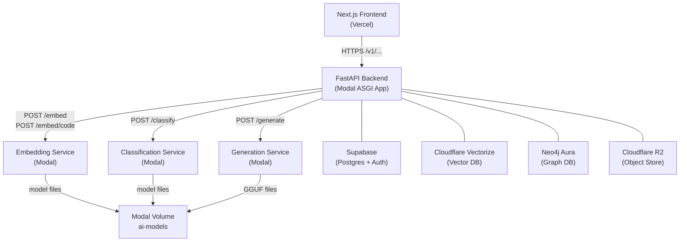
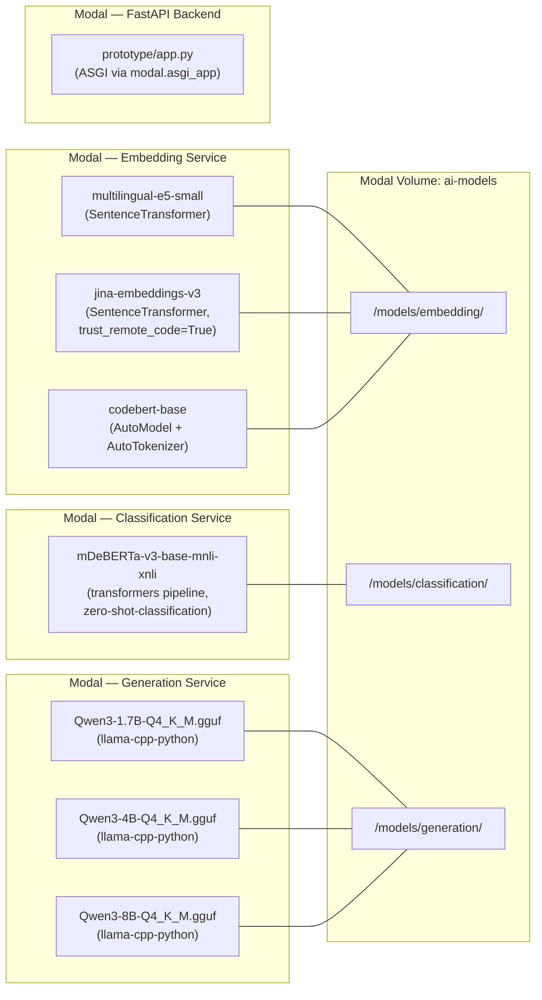
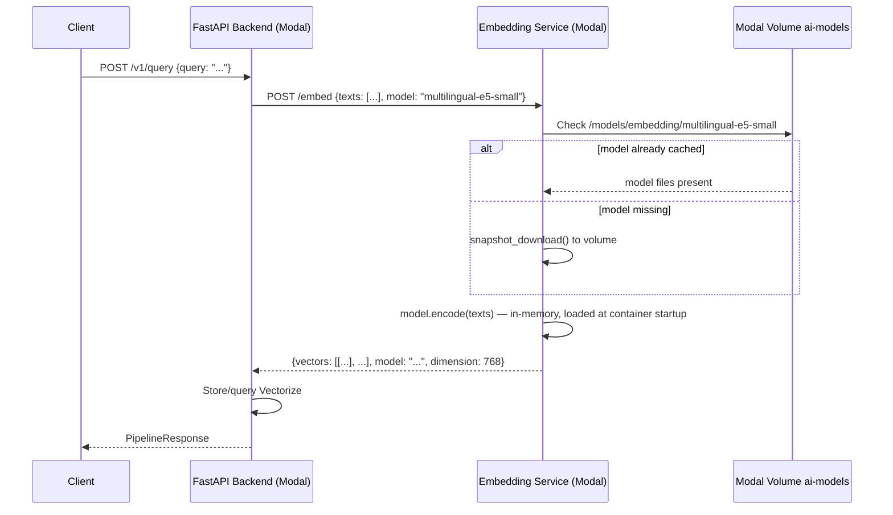
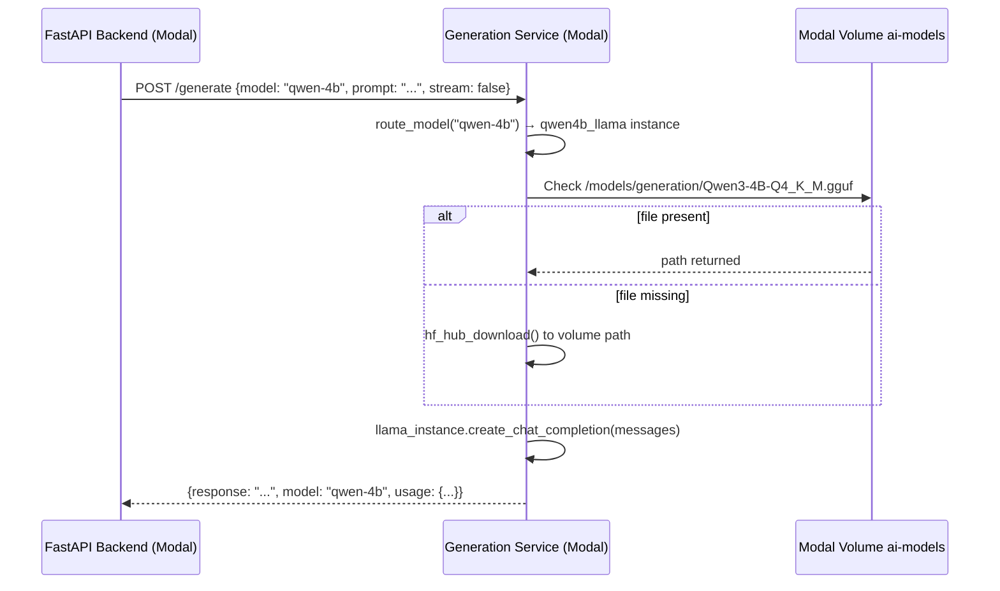
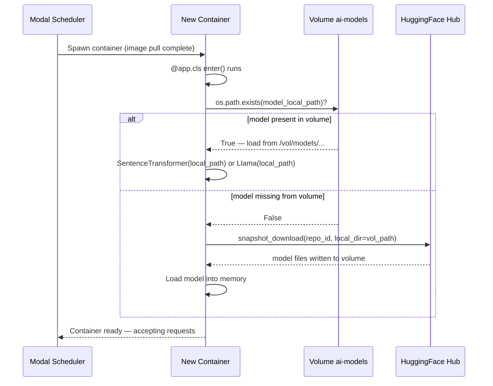

# Design Document: Modal Migration

## Overview

JIMS-AI currently depends on a single Hugging Face Space (`jimstechai-jimsai-embedding-service.hf.space`) that serves all AI model inference — embeddings, zero-shot classification, and GGUF generation — as well as the main FastAPI pipeline itself running on AWS Lambda. This architecture has hard operational limits: HF Spaces spin down when idle (causing cold-start delays of 60–120 s), model files re-download from the Hub on every cold start, and the monolithic Space hosting all seven models on a single CPU-only container cannot scale individual model workloads independently.

This migration moves every AI model and the FastAPI backend to [Modal](https://modal.com). Modal provides persistent network-attached volumes, GPU-accelerated or CPU worker containers that stay warm, container-level model loading at startup, and per-function scaling. The target architecture replaces the single HF Space URL with three Modal-hosted AI services (Embedding, Classification, Generation) and migrates the Lambda-hosted FastAPI backend to a Modal-hosted ASGI app, all behind a single stable API surface that the frontend and all callers already know.

After the migration the following seven HuggingFace Space environment variables are removed from all configuration files and all code that reads them:

| Environment Variable | Current Value |
|---|---|
| `JIMS_EMBEDDING_SERVICE_URL` | `https://jimstechai-jimsai-embedding-service.hf.space` |
| `JIMS_LOCAL_INFERENCE_URL` | `https://jimstechai-jimsai-embedding-service.hf.space` |
| `JIMS_QWEN_SERVICE_URL` | `https://jimstechai-jimsai-embedding-service.hf.space` |
| `JIMS_CAPABILITY_CLASSIFIER_URL` | `https://jimstechai-jimsai-embedding-service.hf.space` |
| `JIMS_MULTIMODAL_ENCODER_URL` | `https://jimstechai-jimsai-embedding-service.hf.space` |
| `HF_SPACE_REPO_ID` | `jimstechai/jimsai-embedding-service` |
| `JIMS_RENDER_AGENT_TOKEN` (HF-specific usage) | shared secret for HF Space |

---

## Architecture

### High-Level System Diagram



### Container Layout



---

## Sequence Diagrams

### Embedding Request Flow



### Generation Request Flow (with model routing)



### Modal Container Cold Start + Model Loading



---

## Components and Interfaces

### A. Embedding Service (`modal_embedding_service.py`)

**Purpose**: Serve semantic, code, and technical embeddings for all three embedding models. Replaces the HF Space `/v1/embed`, `/v1/embed-batch`, and `/v1/encode` endpoints.

**Interface**:

```python
class EmbedRequest(BaseModel):
    texts: list[str]                    # 1–128 texts
    model: str = "multilingual-e5-small"  # "multilingual-e5-small" | "jina-v3" | "codebert"
    purpose: str = "query"              # "query" | "passage" | "document"

class EmbedResponse(BaseModel):
    vectors: list[list[float]]
    model: str
    dimension: int
    fallback: bool

class CodeEmbedRequest(BaseModel):
    texts: list[str]                    # force codebert-base, no model selection
    purpose: str = "document"

# Routes exposed as FastAPI on the Modal ASGI endpoint
POST /embed          → EmbedResponse    (model param selects encoder)
POST /embed/code     → EmbedResponse    (always uses codebert-base)
GET  /health         → {"status": "ok", "models_loaded": {...}}
```

**Responsibilities**:
- Load all three embedding models at container startup from Modal Volume (download from Hub if missing)
- Serve batch text embedding with per-request model selection
- Apply E5 prefix logic (`query:` / `passage:`) for multilingual-e5-small
- Apply `trust_remote_code=True` for jina-embeddings-v3
- Normalize all output vectors to unit length
- Fit/pad vectors to 768 dimensions for consistency
- Provide health endpoint with per-model loaded status

**Model Loading Strategy**:
```python
VOLUME_BASE = "/vol/models/embedding"
MODEL_MAP = {
    "multilingual-e5-small": "intfloat/multilingual-e5-small",
    "jina-v3":               "jinaai/jina-embeddings-v3",
    "codebert":              "microsoft/codebert-base",
}
```

---

### B. Classification Service (`modal_classification_service.py`)

**Purpose**: Serve zero-shot capability classification using mDeBERTa. Replaces the HF Space `/v1/classify/capability` endpoint.

**Interface**:

```python
class ClassifyRequest(BaseModel):
    text: str                              # query to classify, max 4096 chars
    candidate_labels: list[str] | None = None  # defaults to all 9 capability kinds
    hypothesis_template: str = "This request is about {}."

class ClassifyResponse(BaseModel):
    primary_kind: str
    confidence: float
    secondary_kinds: list[str]
    scores: list[dict]          # [{"kind": str, "score": float}]
    model: str

# Route
POST /classify       → ClassifyResponse
GET  /health         → {"status": "ok", "model_loaded": bool}
```

**Responsibilities**:
- Load `MoritzLaurer/mDeBERTa-v3-base-mnli-xnli` at container startup
- Run zero-shot classification against up to 9 capability label strings
- Return ranked `scores` list sorted descending by score
- Map label strings back to capability kind keys

---

### C. Generation Service (`modal_generation_service.py`)

**Purpose**: Serve T1 intent (Qwen3-1.7B), T2 render (Qwen3-4B), and optional heavy generation (Qwen3-8B) from GGUF files. Replaces HF Space `/v1/chat/completions` and `/v1/chat/render`.

**Interface**:

```python
class GenerateRequest(BaseModel):
    model: str                          # "qwen-1.7b" | "qwen-4b" | "qwen-8b"
    prompt: str | None = None           # for simple single-turn completions
    messages: list[ChatMessage] | None = None  # for chat-style completions
    temperature: float = 0.0
    max_tokens: int = 512
    stream: bool = False
    response_format: dict | None = None # {"type": "json_object"} supported

class GenerateResponse(BaseModel):
    response: str
    model: str
    usage: dict                         # {"prompt_tokens": int, "completion_tokens": int}
    finish_reason: str

class ChatMessage(BaseModel):
    role: str                           # "system" | "user" | "assistant"
    content: str

# Routes
POST /generate       → GenerateResponse | StreamingResponse
GET  /health         → {"status": "ok", "models": {"qwen-1.7b": bool, ...}}
```

**Model Routing**:
```python
MODEL_ROUTING = {
    "qwen-1.7b": {
        "repo": "ggml-org/Qwen3-1.7B-GGUF",
        "filename": "Qwen3-1.7B-Q4_K_M.gguf",
        "n_ctx": 4096,
        "max_tokens_default": 256,
    },
    "qwen-4b": {
        "repo": "Qwen/Qwen3-4B-GGUF",
        "filename": "Qwen3-4B-Q4_K_M.gguf",
        "n_ctx": 8192,
        "max_tokens_default": 1200,
    },
    "qwen-8b": {
        "repo": "Qwen/Qwen3-8B-GGUF",
        "filename": "Qwen3-8B-Q4_K_M.gguf",
        "n_ctx": 8192,
        "max_tokens_default": 1200,
    },
}
```

**Responsibilities**:
- Load all three GGUF models at container startup from Modal Volume
- Route `POST /generate` requests to the correct `Llama` instance by `model` field
- Support streaming (`stream=True`) via `StreamingResponse` with SSE
- Strip `<think>...</think>` tags from output when `response_format.type == "json_object"`
- Serialize all concurrent GGUF calls per model via `asyncio.Lock` (llama-cpp is not thread-safe)

---

### D. FastAPI Backend (`modal_backend.py`)

**Purpose**: Host the full `prototype/app.py` FastAPI application on Modal, replacing the AWS Lambda deployment. All existing routes remain identical.

**Interface**: Identical to the existing `prototype/app.py` public routes — no frontend changes required:

```
GET  /health
GET  /metrics
POST /v1/auth/signin
POST /v1/auth/signup
POST /v1/auth/refresh
POST /v1/query
POST /v1/training/ingest
POST /v1/feedback
POST /v1/review/action
POST /v1/sandbox/run
POST /v1/math/solve
GET  /v1/training/dashboard
GET  /v1/training/panels/{panel}/items
POST /v1/canvas/run
GET  /v1/canvas/status/{session_id}
POST /v1/invention/run
GET  /v1/invention/status/{session_id}
POST /v1/memory/insert
POST /v1/memory/update
POST /v1/memory/delete
POST /v1/memory/rollback
GET  /v1/memory/stats
GET  /v1/audit/events
GET  /v1/chat/threads
GET  /v1/chat/threads/{thread_id}/messages
DELETE /v1/chat/threads/{thread_id}
```

**Responsibilities**:
- Replace `JIMS_EMBEDDING_SERVICE_URL` lookups with direct Modal service URL (or Modal internal call)
- Replace `JIMS_LOCAL_INFERENCE_URL` lookups with direct Modal generation service URL
- Replace `JIMS_CAPABILITY_CLASSIFIER_URL` with direct Modal classification service URL
- Expose a stable `https://<org>--jimsai-backend.modal.run` URL to the frontend

---

## Data Models

### Model Artifact Descriptor

```python
@dataclass
class ModelArtifact:
    model_key: str          # "multilingual-e5-small" | "jina-v3" | "codebert" | "mDeBERTa" | "qwen-1.7b" | ...
    hf_repo_id: str         # "intfloat/multilingual-e5-small"
    hf_filename: str | None # None for full snapshot; "Qwen3-4B-Q4_K_M.gguf" for GGUF
    volume_path: str        # "/vol/models/embedding/multilingual-e5-small"
    model_type: str         # "sentence_transformer" | "transformers_cls" | "gguf"
    dimensions: int | None  # 768 for embeddings; None for generative
```

### Volume Layout

```
/vol/models/
├── embedding/
│   ├── multilingual-e5-small/        ← snapshot_download destination
│   ├── jina-embeddings-v3/
│   └── codebert-base/
├── classification/
│   └── mDeBERTa-v3-base-mnli-xnli/
└── generation/
    ├── Qwen3-1.7B-Q4_K_M.gguf       ← single GGUF file
    ├── Qwen3-4B-Q4_K_M.gguf
    └── Qwen3-8B-Q4_K_M.gguf
```

### Internal Request/Response Shapes (Backend → Modal Services)

```python
# Embedding
{"texts": ["..."], "model": "multilingual-e5-small", "purpose": "query"}
→ {"vectors": [[0.12, ...]], "model": "multilingual-e5-small", "dimension": 768, "fallback": false}

# Classification
{"text": "Write me a Python function", "candidate_labels": null}
→ {"primary_kind": "coding", "confidence": 0.89, "secondary_kinds": [], "scores": [...]}

# Generation (non-streaming)
{"model": "qwen-1.7b", "messages": [{"role": "user", "content": "..."}], "temperature": 0, "max_tokens": 256}
→ {"response": "...", "model": "qwen-1.7b", "usage": {...}, "finish_reason": "stop"}
```

---

## Key Functions with Formal Specifications

### `ensure_model_on_volume(artifact: ModelArtifact) → Path`

**Preconditions:**
- `artifact.volume_path` is writable (Modal Volume is mounted at `/vol/models`)
- HuggingFace Hub is reachable, OR `artifact.volume_path` already contains model files
- `HF_TOKEN` Modal Secret is configured for gated repos (Jina v3 requires it)

**Postconditions:**
- Returns a `Path` pointing to model files on the volume
- If model was already cached: returns immediately without network I/O
- If model was missing: files are downloaded and written to volume before return
- On failure: raises `RuntimeError` with descriptive message; container startup fails fast

**Loop Invariants:**
- `os.path.exists(artifact.volume_path)` is monotonically true after first successful download
- Volume write operations are atomic at the file level (HF Hub download uses temp → rename)

---

### `load_sentence_transformer(model_path: str, trust_remote_code: bool) → SentenceTransformer`

**Preconditions:**
- `model_path` is an absolute path to a directory containing `config.json`
- If `trust_remote_code=True`, the model directory contains custom Python modules

**Postconditions:**
- Returns a loaded `SentenceTransformer` instance with weights in memory
- Model is ready for immediate `.encode()` calls
- No network I/O occurs (model is already on volume)

---

### `embed_batch(texts: list[str], model_key: str, purpose: str) → list[list[float]]`

**Preconditions:**
- `1 ≤ len(texts) ≤ 128`
- `model_key ∈ {"multilingual-e5-small", "jina-v3", "codebert"}`
- All model instances are loaded in memory (enforced by `@app.cls` `__enter__`)
- Each `text` has `len(text) ≤ 16000` characters (truncated by caller if not)

**Postconditions:**
- `len(result) == len(texts)`
- For all `v in result`: `len(v) == 768` and `|v| ≈ 1.0` (unit-normalized)
- E5-small inputs are prefixed with `"query: "` when `purpose == "query"`, else `"passage: "`
- CodeBERT uses mean-pool over CLS token; result is L2-normalized to 768d
- Jina v3 uses `SentenceTransformer.encode(normalize_embeddings=True)`

**Loop Invariants:** (internal batch processing)
- All processed texts have been encoded with the same model instance
- Output vector list length equals input text list length at all intermediate steps

---

### `route_and_generate(request: GenerateRequest) → GenerateResponse`

**Preconditions:**
- `request.model ∈ {"qwen-1.7b", "qwen-4b", "qwen-8b"}`
- At least one of `request.prompt` or `request.messages` is non-null
- The routed model's `Llama` instance is loaded and not currently held by another coroutine's lock

**Postconditions:**
- Returns a `GenerateResponse` with non-empty `response` string
- `response.model` matches `request.model`
- If `stream=True`, returns `StreamingResponse` yielding SSE lines
- If `response_format.type == "json_object"`, `<think>...</think>` blocks are stripped and outer JSON is extracted
- On inference error: raises `HTTPException(503)` and resets the model lock

**Loop Invariants:**
- The `asyncio.Lock` for the routed model is held for the duration of exactly one inference call
- No two coroutines can hold the same model's lock simultaneously

---

### `download_gguf_to_volume(repo_id: str, filename: str, dest_path: str) → str`

**Preconditions:**
- `dest_path` parent directory is writable on Modal Volume
- `repo_id` is a valid HuggingFace repository ID containing `filename`
- `HF_TOKEN` is configured (required if repo is gated)

**Postconditions:**
- Returns `dest_path` as a string
- The file at `dest_path` is a valid GGUF file (binary, non-zero size)
- If file already exists at `dest_path`, function returns immediately (idempotent)

---

## Algorithmic Pseudocode

### Container Startup Algorithm (All Three Modal Services)

```pascal
ALGORITHM container_startup(service_type)
INPUT: service_type ∈ {EMBEDDING, CLASSIFICATION, GENERATION}
OUTPUT: loaded_models of type Map<String, ModelHandle>

BEGIN
  vol ← mount_modal_volume("ai-models", "/vol/models")
  artifacts ← get_artifact_list(service_type)
  loaded_models ← {}

  FOR each artifact IN artifacts DO
    ASSERT artifact.volume_path starts with "/vol/models"

    IF NOT file_exists(artifact.volume_path) THEN
      LOG "Model not in volume, downloading: " + artifact.hf_repo_id
      download_model_to_volume(artifact)
      LOG "Download complete: " + artifact.volume_path
    ELSE
      LOG "Loading model from volume cache: " + artifact.volume_path
    END IF

    model_handle ← load_model(artifact)
    loaded_models[artifact.model_key] ← model_handle

    ASSERT loaded_models[artifact.model_key] IS NOT NULL
    LOG "Model ready: " + artifact.model_key
  END FOR

  ASSERT len(loaded_models) == len(artifacts)
  RETURN loaded_models
END
```

**Loop Invariant:** After each iteration, all previously processed model keys exist in `loaded_models` and have non-null handles.

---

### Embedding Dispatch Algorithm

```pascal
ALGORITHM dispatch_embed(request: EmbedRequest, loaded_models: Map) → EmbedResponse
INPUT: request.texts (1–128 strings), request.model, request.purpose
OUTPUT: EmbedResponse with normalized vectors

BEGIN
  ASSERT len(request.texts) >= 1 AND len(request.texts) <= 128
  ASSERT request.model IN loaded_models

  model ← loaded_models[request.model]
  vectors ← []

  IF request.model == "codebert" THEN
    FOR each text IN request.texts DO
      tokens ← codebert_tokenizer(text[:512], return_tensors="pt")
      output ← codebert_model(tokens)
      vec ← mean_pool(output.last_hidden_state)
      vectors.append(l2_normalize(vec))
    END FOR
  ELSE
    texts_prefixed ← []
    FOR each text IN request.texts DO
      IF request.model == "multilingual-e5-small" THEN
        prefix ← IF request.purpose == "query" THEN "query: " ELSE "passage: "
        texts_prefixed.append(prefix + text[:16000])
      ELSE
        texts_prefixed.append(text[:16000])
      END IF
    END FOR
    raw_vectors ← model.encode(texts_prefixed, normalize_embeddings=True)
    vectors ← [fit_to_768(v) for v in raw_vectors]
  END IF

  ASSERT len(vectors) == len(request.texts)
  FOR each v IN vectors DO
    ASSERT abs(norm(v) - 1.0) < 1e-5   // unit-normalized
    ASSERT len(v) == 768
  END FOR

  RETURN EmbedResponse(vectors=vectors, model=request.model, dimension=768)
END
```

---

### Generation Routing Algorithm

```pascal
ALGORITHM route_and_generate(request: GenerateRequest, model_instances: Map) → GenerateResponse
INPUT: request.model ∈ {"qwen-1.7b", "qwen-4b", "qwen-8b"}
OUTPUT: GenerateResponse

BEGIN
  ASSERT request.model IN {"qwen-1.7b", "qwen-4b", "qwen-8b"}
  ASSERT request.model IN model_instances

  llama_instance ← model_instances[request.model]
  lock ← locks[request.model]

  messages ← build_messages(request)
  ASSERT len(messages) >= 1

  ACQUIRE lock
    IF request.stream THEN
      stream_gen ← llama_instance.create_chat_completion(
        messages=messages,
        temperature=request.temperature,
        max_tokens=request.max_tokens,
        stream=True
      )
      RETURN StreamingResponse(sse_generator(stream_gen))
    ELSE
      completion ← llama_instance.create_chat_completion(
        messages=messages,
        temperature=request.temperature,
        max_tokens=request.max_tokens
      )
      content ← completion.choices[0].message.content

      IF request.response_format.type == "json_object" THEN
        content ← strip_think_tags(content)
        content ← extract_json_object(content)
      END IF

      RETURN GenerateResponse(
        response=content,
        model=request.model,
        usage=completion.usage,
        finish_reason=completion.choices[0].finish_reason
      )
    END IF
  RELEASE lock
END
```

---

## Migration Mapping: HF Space → Modal Services

The following table maps every call site in the current codebase to its Modal replacement:

| Current Call Site | HF Space Endpoint | Modal Replacement |
|---|---|---|
| `provider_adapters.py` `CloudflareVectorizeIndex.query_vectors` | `JIMS_EMBEDDING_SERVICE_URL` `/v1/embed` | Modal Embedding Service `POST /embed` |
| `encoder/adaptive_hybrid_encoder.py` `_fetch_remote_vector()` | `JIMS_EMBEDDING_SERVICE_URL` `/v1/embed` | Modal Embedding Service `POST /embed` |
| `capability_router.py` `_semantic_embedding_scores()` | `JIMS_EMBEDDING_SERVICE_URL` `/v1/embed` | Modal Embedding Service `POST /embed` |
| `capability_router.py` `_zero_shot_classifier_scores()` | `JIMS_CAPABILITY_CLASSIFIER_URL` `/v1/classify/capability` | Modal Classification Service `POST /classify` |
| `model_bridge.py` `_local_chat_json()` T1 | `JIMS_LOCAL_INFERENCE_URL` `/v1/chat/completions` | Modal Generation Service `POST /generate` `model=qwen-1.7b` |
| `model_bridge.py` `_local_chat_json()` T2 | `JIMS_LOCAL_INFERENCE_URL` `/v1/chat/render` | Modal Generation Service `POST /generate` `model=qwen-4b` |
| `semantic_compiler.py` `SemanticCompilerEmbedder` | `JIMS_EMBEDDING_SERVICE_URL` `/v1/embed` | Modal Embedding Service `POST /embed` |
| `api-gateway/app/main.py` `_wake_hf_space()` | `JIMS_EMBEDDING_SERVICE_URL` `/health` | Modal Backend health probe at startup |

### Environment Variable Replacement

| Old Variable | New Variable | Value |
|---|---|---|
| `JIMS_EMBEDDING_SERVICE_URL=https://jimstechai-jimsai-embedding-service.hf.space` | `JIMS_EMBEDDING_SERVICE_URL=https://<org>--jimsai-embedding-service.modal.run` | Modal Embedding Service URL |
| `JIMS_LOCAL_INFERENCE_URL=https://jimstechai-jimsai-embedding-service.hf.space` | `JIMS_GENERATION_SERVICE_URL=https://<org>--jimsai-generation-service.modal.run` | Modal Generation Service URL |
| `JIMS_QWEN_SERVICE_URL=...` | (removed, merged into `JIMS_GENERATION_SERVICE_URL`) | — |
| `JIMS_CAPABILITY_CLASSIFIER_URL=...` | `JIMS_CLASSIFICATION_SERVICE_URL=https://<org>--jimsai-classification-service.modal.run` | Modal Classification Service URL |
| `JIMS_MULTIMODAL_ENCODER_URL=...` | `JIMS_EMBEDDING_SERVICE_URL` (reused) | Same Modal Embedding Service |
| `JIMS_RENDER_AGENT_TOKEN` | `JIMS_MODAL_API_KEY` (Modal Secret) | Bearer token for all three services |

---

## Error Handling

### Error Scenario 1: Model Not on Volume, Hub Unreachable

**Condition**: Container starts up, model file is missing from volume, and HuggingFace Hub is unreachable (network error or rate limit).

**Response**: Container startup raises `RuntimeError("Cannot load model X: volume miss + hub unreachable")`. Modal marks the container as failed and retries up to 3 times with backoff. After 3 failures, the Modal endpoint returns HTTP 503 to callers.

**Recovery**: Once Hub is reachable again, the next container spawn downloads the model. Models already on the volume are unaffected — only the missing model blocks its respective service.

---

### Error Scenario 2: GGUF Inference Hard Failure (ggml_assert)

**Condition**: `llama-cpp-python` raises an exception containing `ggml_assert` or `repack` during inference, indicating a corrupt model state.

**Response**: The generation service catches the exception, resets the `Llama` instance for that model key to `None`, releases the lock, and returns HTTP 503. The next request to the same model will trigger a reload from the volume (without re-downloading from Hub).

**Recovery**: The model instance is lazily reloaded on the next request. This pattern mirrors the existing `inference_failed_hard()` check in `infrastructure/huggingface-space/jimsai-embedding-service/app.py`.

---

### Error Scenario 3: Backend → Modal Service Timeout

**Condition**: The FastAPI backend calls the Embedding Service or Generation Service and the request exceeds the configured timeout (8 s for embeddings, 120 s for generation).

**Response**: `httpx.AsyncClient` raises `TimeoutException`. The backend catches this and falls back to hash-projection embeddings (for embedding calls) or returns a structured error to the caller (for generation calls).

**Recovery**: Automatic on next request. No manual intervention needed. Timeout values are configurable via `JIMS_EMBEDDING_TIMEOUT` and `JIMS_GENERATION_TIMEOUT` env vars.

---

### Error Scenario 4: Volume Mount Failure

**Condition**: Modal Volume `ai-models` cannot be mounted at container startup (volume deleted, permissions issue, regional outage).

**Response**: Container startup fails immediately. Modal retries container spawn. All three AI services fail their health checks.

**Recovery**: Recreate the volume with `modal volume create ai-models` and re-trigger a deployment to repopulate model files.

---

## Testing Strategy

### Unit Testing Approach

Each Modal service has an isolated `tests/` directory. Unit tests mock the Modal Volume mount and model loading to test routing and encoding logic independently.

Key test cases:
- `test_embed_model_dispatch`: verifies `multilingual-e5-small`, `jina-v3`, `codebert` route to the correct loaded instance
- `test_embed_output_shape`: verifies all output vectors are 768-dimensional and unit-normalized
- `test_generation_model_routing`: verifies `qwen-1.7b`, `qwen-4b`, `qwen-8b` route to the correct `Llama` instance
- `test_generation_lock_serialization`: verifies concurrent requests to the same model are serialized
- `test_volume_cache_hit`: verifies no download occurs when model files exist on volume
- `test_volume_cache_miss_download`: verifies download is triggered and volume path is used
- `test_classification_label_mapping`: verifies mDeBERTa output labels map back to capability kind keys

### Property-Based Testing Approach

**Property Test Library**: `hypothesis`

Key properties to test:

```python
from hypothesis import given, strategies as st

# Property 1: Embedding output is always unit-normalized
@given(st.lists(st.text(min_size=1, max_size=200), min_size=1, max_size=10))
def test_embed_always_unit_normalized(texts):
    response = embed_batch(texts, "multilingual-e5-small", "query")
    for vec in response.vectors:
        assert abs(sum(v**2 for v in vec)**0.5 - 1.0) < 1e-4

# Property 2: Embedding output length always equals input length
@given(st.lists(st.text(min_size=1), min_size=1, max_size=128))
def test_embed_output_length_matches_input(texts):
    response = embed_batch(texts, "multilingual-e5-small", "query")
    assert len(response.vectors) == len(texts)

# Property 3: Volume check is idempotent — calling ensure_model_on_volume twice
# with the same artifact never triggers a second download
@given(st.sampled_from(["multilingual-e5-small", "jina-v3", "codebert"]))
def test_ensure_model_idempotent(model_key):
    artifact = get_artifact(model_key)
    count_before = download_call_count()
    ensure_model_on_volume(artifact)
    ensure_model_on_volume(artifact)  # second call
    assert download_call_count() == count_before + (1 if not was_cached else 0)

# Property 4: Generation request always returns a non-empty string for valid models
@given(
    st.sampled_from(["qwen-1.7b", "qwen-4b", "qwen-8b"]),
    st.text(min_size=1, max_size=500)
)
def test_generate_always_returns_nonempty(model, prompt):
    request = GenerateRequest(model=model, prompt=prompt, max_tokens=32)
    response = route_and_generate(request)
    assert isinstance(response.response, str)
    assert len(response.response) >= 0  # may be empty if model stops immediately
```

### Integration Testing Approach

Integration tests spin up Modal services against the real Modal infrastructure (test environment) and verify end-to-end call chains:

- `test_backend_to_embedding_service`: FastAPI backend calls Modal Embedding Service, verifies vectors are returned and stored in Vectorize
- `test_backend_to_classification_service`: FastAPI backend calls Modal Classification Service for capability routing
- `test_backend_full_query_pipeline`: POST `/v1/query` travels through backend → embedding → classification → generation → response
- `test_model_file_persistence`: After first container cold start, confirm volume contains model files and second startup skips download

---

## Performance Considerations

### Container Warm-Up Times (Estimated)

| Service | Models Loaded at Startup | First Cold Start | Subsequent Starts (volume cached) |
|---|---|---|---|
| Embedding | multilingual-e5-small + jina-v3 + codebert | ~3–5 min (download ~1.2 GB) | ~45–90 s (load from volume) |
| Classification | mDeBERTa-v3-base-mnli-xnli | ~1–2 min (download ~560 MB) | ~20–40 s |
| Generation | qwen-1.7b + qwen-4b + qwen-8b GGUF | ~8–12 min (download ~6.5 GB) | ~2–4 min (load from volume) |
| Backend | No models (delegates to services) | ~15–30 s | ~10–15 s |

### Request Latency Targets (container warm)

| Operation | Target P50 | Target P99 |
|---|---|---|
| Single text embedding (e5-small) | < 50 ms | < 200 ms |
| Batch embedding (128 texts, e5-small) | < 500 ms | < 2 s |
| Zero-shot classification | < 800 ms | < 3 s |
| Generation qwen-1.7b (256 tokens) | < 5 s | < 15 s |
| Generation qwen-4b (1200 tokens) | < 20 s | < 45 s |
| Generation qwen-8b (1200 tokens) | < 30 s | < 60 s |

### Scaling Configuration

- **Embedding Service**: `min_containers=1`, `max_containers=5` — keeps one warm container to prevent cold starts on embedding calls
- **Classification Service**: `min_containers=1`, `max_containers=3`
- **Generation Service**: `min_containers=1`, `max_containers=2` — GGUF models are memory-heavy (~6.5 GB total); scale conservatively
- **Backend**: `min_containers=1`, `max_containers=10` — stateless ASGI, scales freely

### Memory Requirements per Container

| Service | Estimated Memory |
|---|---|
| Embedding Service (all 3 models) | ~2.5 GB |
| Classification Service | ~1.5 GB |
| Generation Service (all 3 GGUFs loaded) | ~8 GB |
| Backend | ~512 MB |

---

## Security Considerations

### Modal Secrets

All sensitive configuration is stored in Modal Secrets (not environment variables in code):

```
modal-jimsai-secrets:
  JIMS_MODAL_API_KEY        ← bearer token for inter-service auth (replaces JIMS_RENDER_AGENT_TOKEN)
  HF_TOKEN                  ← HuggingFace read token (for volume population)
  SUPABASE_URL
  SUPABASE_SERVICE_KEY
  SUPABASE_ANON_KEY
  NEO4J_URI
  NEO4J_PASSWORD
  CF_VECTORIZE_API_TOKEN
  CF_R2_ACCESS_KEY
  CF_R2_SECRET_KEY
  GROQ_API_KEY
```

### Inter-Service Authentication

All three Modal AI services require a `Bearer` token matching `JIMS_MODAL_API_KEY`. The FastAPI backend injects this token on every outbound call to the embedding, classification, and generation services. Unauthenticated requests return HTTP 401.

### Network Isolation

Modal services do not have public ingress by default. Only the FastAPI backend endpoint is publicly accessible. The three AI services are accessible via their Modal-generated URLs, which are never exposed to the frontend.

The `_wake_hf_space()` background task in `services/api-gateway/app/main.py` is removed entirely — no equivalent startup ping is needed since Modal containers stay warm.

---

## Dependencies

### Python Packages per Service

**Embedding Service**:
```
modal>=0.72
fastapi>=0.111
uvicorn>=0.30
sentence-transformers>=2.7
transformers>=4.41
torch>=2.3
einops>=0.7
huggingface-hub>=0.23
numpy>=1.26
pydantic>=2.7
```

**Classification Service**:
```
modal>=0.72
fastapi>=0.111
uvicorn>=0.30
transformers>=4.41
torch>=2.3
huggingface-hub>=0.23
pydantic>=2.7
```

**Generation Service**:
```
modal>=0.72
fastapi>=0.111
uvicorn>=0.30
llama-cpp-python>=0.2.90
huggingface-hub>=0.23
pydantic>=2.7
```

**Backend (additions to existing)**:
```
modal>=0.72
httpx>=0.27     # already present
```

### Modal Infrastructure

- **Modal Volume**: `ai-models` — single shared volume mounted by all three AI services
- **Modal Secrets**: `modal-jimsai-secrets` — one secret object containing all sensitive keys
- **Modal Images**: One per service, built from `python:3.11-slim` with service-specific packages
- **Modal ASGI App**: Used for the FastAPI backend with `modal.asgi_app()`
- **Modal Web Endpoint**: Used for the three AI services to expose HTTP endpoints

### Infrastructure Retirement

After successful migration and verification, the following infrastructure is retired:
- `infrastructure/huggingface-space/jimsai-embedding-service/` — entire directory archived
- `scripts/deploy_hf_space.py` — deployment script removed
- `services/api-gateway/app/main.py` `_wake_hf_space()` function — removed
- HF Space env vars in `.env`, `.env.example`, `.env.production.example` — removed or replaced


---

## Correctness Properties

*A property is a characteristic or behavior that should hold true across all valid executions of a system — essentially, a formal statement about what the system should do. Properties serve as the bridge between human-readable specifications and machine-verifiable correctness guarantees.*

The following properties must hold at all times after the migration is complete:

### Property 1: No HF Space References

For all source files `f` in the repository, `f` does not contain the string `jimstechai-jimsai-embedding-service.hf.space`.

**Validates: Requirements 1.1**

### Property 2: Single API Surface Preservation

For all existing frontend calls targeting a route `r ∈ /v1/...`, `r` resolves to the same handler logic as before the migration. No existing route is removed or renamed.

**Validates: Requirements 2.1, 2.3**

### Property 3: Embedding Idempotency

For all input texts `t` and model `m ∈ {"multilingual-e5-small", "jina-v3", "codebert"}` and purpose `p`, calling `embed_batch([t], m, p)` twice with the same inputs returns corresponding vectors with pairwise cosine similarity ≥ 0.9999 (deterministic within floating-point tolerance).

**Validates: Requirements 4.9**

### Property 4: Vector Dimensionality Invariant

For all embedding requests with any list of 1–128 non-empty strings and any valid model, every vector `v` in the response satisfies `len(v) = 768`.

**Validates: Requirements 4.2**

### Property 5: Unit Norm Invariant

For all embedding requests with any list of 1–128 non-empty strings and any valid model, every vector `v` in the response satisfies `|‖v‖₂ - 1.0| < 1e-4`.

**Validates: Requirements 4.3**

### Property 6: Embedding Output Count Matches Input Count

For all embedding requests with any list of texts of length `n` where `1 ≤ n ≤ 128`, the response contains exactly `n` vectors.

**Validates: Requirements 4.1**

### Property 7: Code Embedding Endpoint Always Uses CodeBERT

For any list of texts posted to `POST /embed/code`, the response field `model` is always `"codebert"` regardless of any model field included in the request.

**Validates: Requirements 4.6**

### Property 8: Classification Scores Are Sorted Descending

For any non-empty `text` input to the Classification_Service, the returned `scores` list satisfies `scores[i].score ≥ scores[i+1].score` for all valid `i`, and `primary_kind` equals `scores[0].kind` and `confidence` equals `scores[0].score`.

**Validates: Requirements 6.3, 6.4, 6.5**

### Property 9: Volume Idempotency

For all model artifacts `a`, if `os.path.exists(a.volume_path)` is true before calling `ensure_model_on_volume(a)`, then no network I/O occurs and the function returns the existing path unchanged. Calling the function twice for a cached artifact does not increment the download call count.

**Validates: Requirements 10.4, 10.5**

### Property 10: Generation Model Routing Completeness

For all `model ∈ {"qwen-1.7b", "qwen-4b", "qwen-8b"}` and any non-empty prompt string, `route_and_generate` returns a `GenerateResponse` where `response.model` matches the requested model key, without raising an exception when the respective `Llama` instance is loaded and the lock is acquirable.

**Validates: Requirements 8.1**

### Property 11: Lock Safety

For all models `m ∈ {"qwen-1.7b", "qwen-4b", "qwen-8b"}`, at any point in time at most one coroutine holds `locks[m]`. Concurrent requests to the same model are serialized, not dropped.

**Validates: Requirements 8.7**

### Property 12: Think-Tag Stripping in JSON Mode

For any prompt and any model, when `response_format.type == "json_object"`, the returned `response` string contains no `<think>...</think>` blocks.

**Validates: Requirements 8.6**

### Property 13: Unauthenticated Requests Rejected

For any request to any of the three Modal AI services (Embedding_Service, Classification_Service, Generation_Service) that does not include a valid `Authorization: Bearer <JIMS_MODAL_API_KEY>` header, the response status code is `401` regardless of the request body content.

**Validates: Requirements 15.1, 15.2, 15.3**

### Property 14: Secrets Never in Code

For all source files `f` in the repository, `f` does not contain literal values for `JIMS_MODAL_API_KEY`, `HF_TOKEN`, `SUPABASE_SERVICE_KEY`, or any other key stored in Modal_Secrets. These values exist only in Modal Secrets storage.

**Validates: Requirements 11.1, 11.2**

### Property 15: Startup Completeness

For each Modal service `s ∈ {Embedding_Service, Classification_Service, Generation_Service, Backend}`, if all required model files are present in the Volume, `s` reaches "ready" state and passes its `/health` check within 120 seconds of container spawn.

**Validates: Requirements 3.4, 5.4, 7.4**
