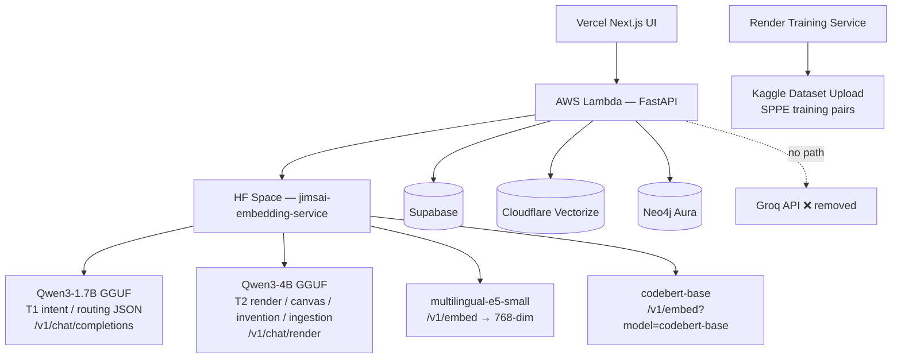
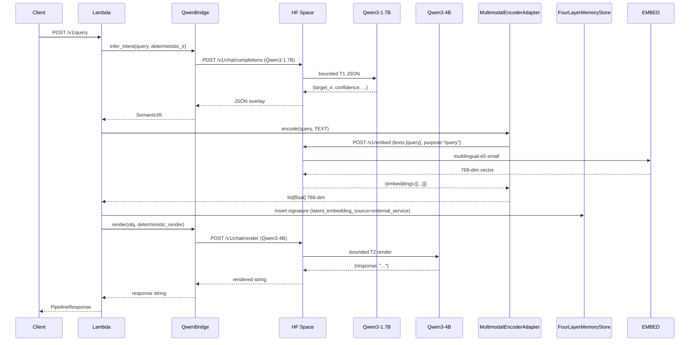
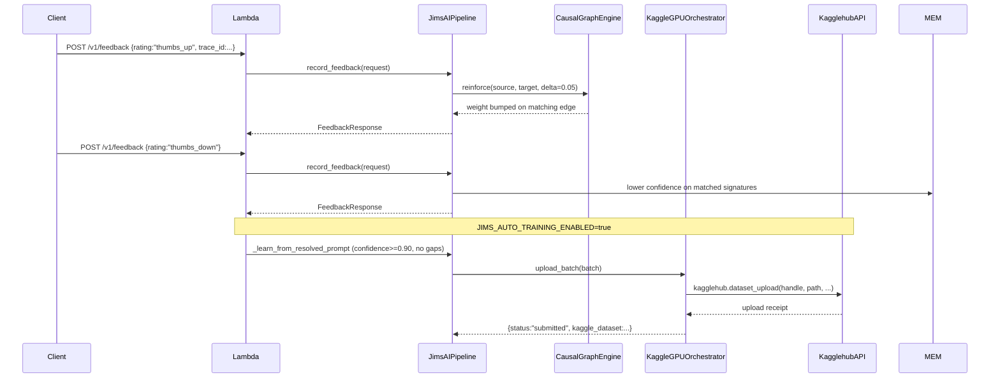
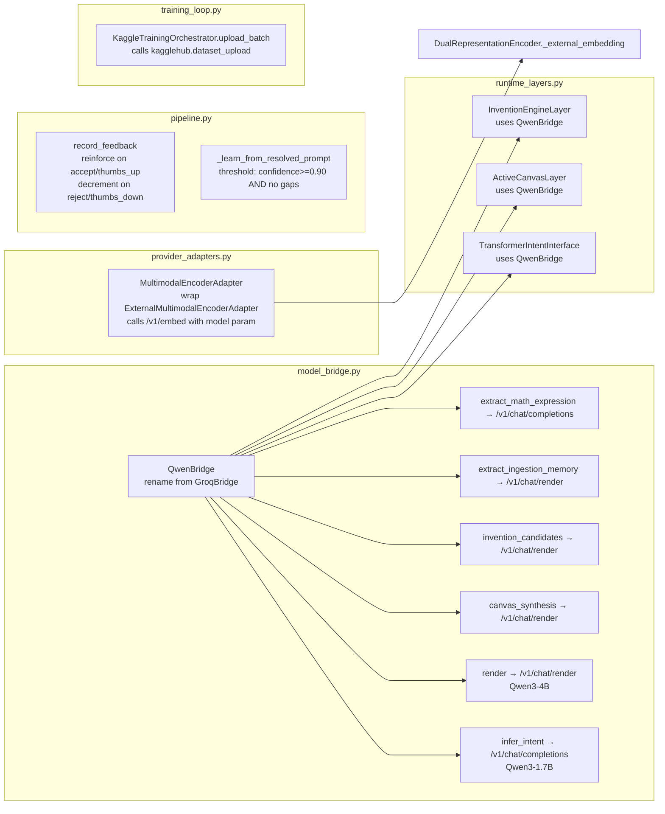
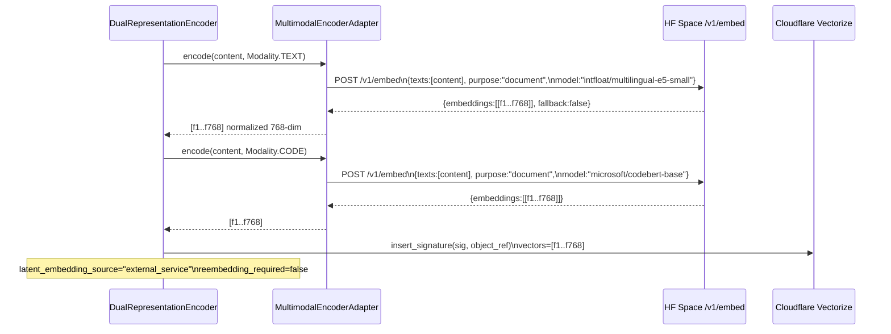

# Design Document: Qwen-Only Pipeline — Complete Gap Closure

## Overview

This document covers the complete technical design to close five production gaps in the JIMS-AI prototype at `prototype/jimsai/`. After these changes, every LLM call routes exclusively through the Hugging Face Space's Qwen3-1.7B (T1 / routing) and Qwen3-4B (T2 / render / canvas / invention / ingestion) instances. Groq naming and dead Groq-specific code are removed, real 768-dim embeddings replace SHA-256 hash projections, the feedback loop reinforces the causal graph, resolution learning uses a clean confidence threshold, and Kaggle SPPE training uploads actually call the Kaggle API.

The five gaps addressed are: (1) GroqBridge rename and cleanup, (2) MultimodalEncoderAdapter `encode()` returning real 768-dim vectors, (3) `record_feedback()` wired to `graph.reinforce()`/confidence decrement, (4) `_learn_from_resolved_prompt()` threshold fix, and (5) `KaggleTrainingOrchestrator.upload_batch()` calling the live Kaggle API.

---

## Architecture



### Data Flow — Query Path



### Data Flow — Training / Feedback Path



---

## Component Map



---

## Sequence Diagrams

### Gap 2 — Real Embedding Flow



### Gap 3 — Feedback Reinforcement Flow

```mermaid
sequenceDiagram
    participant API as /v1/feedback
    participant P as pipeline.record_feedback
    participant MEM as FourLayerMemoryStore
    participant G as CausalGraphEngine
    participant SB as SupabasePostgresStore

    API->>P: FeedbackRequest{rating="thumbs_up", trace_id=X}
    P->>MEM: find signatures matching trace_id
    loop each entity edge
        P->>G: reinforce(entity_source, entity_target, delta=0.05)
    end
    P->>SB: save_user_feedback(record)
    P-->>API: FeedbackResponse{accepted=true}

    API->>P: FeedbackRequest{rating="thumbs_down", trace_id=Y}
    P->>MEM: find signatures matching trace_id
    loop each matched signature
        P: sig.confidence.score = max(0.1, score - 0.1)
        P->>MEM: update(sig)
    end
    P->>SB: save_user_feedback(record)
    P-->>API: FeedbackResponse{accepted=true}
```

---

## Components and Interfaces

### Component 1: QwenBridge (`model_bridge.py`)

**Purpose**: Single adapter for all LLM calls, routing exclusively to the HF Space Qwen endpoints. No Groq API keys, no Groq URLs, no dead model-name env vars.

**Rename plan**:
- Class `GroqBridge` → `QwenBridge`
- All internal `self.intent_model`, `self.render_model`, etc., still read local inference URLs (no change to semantics)
- Remove dead Groq model-name reads (see Low-Level section)

**Interface** (after cleanup):

```python
class QwenBridge:
    # Constructor reads JIMS_LLM_PROVIDER, JIMS_LOCAL_* vars only
    def __init__(self) -> None: ...

    @property
    def available(self) -> bool:
        """True if local_first AND local_url are set."""

    async def infer_intent(self, raw_input: str, deterministic_ir: dict) -> dict | None:
        """T1 call → /v1/chat/completions via Qwen3-1.7B. Returns overlay JSON or None."""

    async def render(self, obj: VerifiedCognitiveObject, deterministic_render: str) -> str | None:
        """T2 call → /v1/chat/render via Qwen3-4B. Returns rendered string or None."""

    async def canvas_synthesis(self, content: str) -> dict | None:
        """Canvas call → /v1/chat/render via Qwen3-4B."""

    async def invention_candidates(self, goal: str, context: dict) -> dict | None:
        """Invention call → /v1/chat/render via Qwen3-4B."""

    async def extract_ingestion_memory(self, content: str, context: dict) -> dict | None:
        """Ingestion call → /v1/chat/render via Qwen3-4B."""

    async def extract_math_expression(self, raw_input: str, context: dict | None) -> dict | None:
        """Math normalizer → /v1/chat/completions via Qwen3-1.7B."""

    async def classify_capability(self, raw_input: str, deterministic_context: dict) -> dict | None:
        """Capability router → /v1/chat/completions via Qwen3-1.7B."""
```

**Responsibilities**:
- Route ALL LLM calls through `_local_chat_json` (completions) or `_render_chat_json` (render)
- Never call an external Groq API
- Honour all existing `JIMS_ENABLE_GROQ_*` flags for backward compat (just route to local)
- Expose `available` as `bool(self.local_first and self.local_url)` — unchanged semantics, just clean naming

---

### Component 2: MultimodalEncoderAdapter (`provider_adapters.py`)

**Purpose**: Implement `encode(content, modality) -> list[float]` that calls `/v1/embed` with per-modality model selection, returning real 768-dim vectors. Wired into `ProductionRuntime.multimodal` and thus into `DualRepresentationEncoder._external_embedding`.

**Interface**:

```python
class MultimodalEncoderAdapter:
    """Calls JIMS_EMBEDDING_SERVICE_URL/v1/embed with per-modality model selection."""

    def __init__(self, settings: ProductionSettings) -> None: ...

    @property
    def configured(self) -> bool:
        """True if JIMS_EMBEDDING_SERVICE_URL is set."""

    def check(self) -> str:
        """GET /health; raise on failure."""

    def encode(self, content: str, modality: Modality) -> list[float]:
        """
        Call /v1/embed with model selected by modality:
          TEXT / DATA  → intfloat/multilingual-e5-small (default)
          CODE         → microsoft/codebert-base
        Returns normalized 768-dim vector or [] on any failure.
        """

    def _model_for_modality(self, modality: Modality) -> str: ...
    def _extract_vector(self, payload: dict) -> list[float]: ...
```

**Model selection logic**:

```
modality == CODE  →  model = "microsoft/codebert-base"
modality == TEXT  →  model = "intfloat/multilingual-e5-small"
modality == DATA  →  model = "intfloat/multilingual-e5-small"
default           →  model = "intfloat/multilingual-e5-small"
```

The HF Space `/v1/embed` already accepts an optional `model` parameter. When omitted it defaults to the space's configured `JIMS_EMBEDDING_MODEL`. The adapter passes it explicitly so the correct model is always used.

---

### Component 3: Feedback Loop (`pipeline.py`)

**Purpose**: `record_feedback()` currently stores events but does nothing to the graph or signature confidence. After the fix it calls `graph.reinforce()` on positive feedback and decrements confidence on negative feedback.

**CausalGraphEngine.reinforce signature** (already exists, no change needed):

```python
def reinforce(self, source: str, target: str, delta: float = 0.03) -> bool:
    """Bump edge weight by delta; clamp to 1.0. Returns True if edge found."""
```

**Updated `record_feedback` logic** (additions only):

```python
async def record_feedback(self, request: FeedbackRequest) -> FeedbackResponse:
    # ... existing storage code unchanged ...

    positive = request.rating in {"thumbs_up", "accept", "positive", "learn_this"}
    negative = request.rating in {"thumbs_down", "reject", "negative"}

    # Resolve signatures that belong to this trace
    matched_sigs = self._signatures_for_trace(request.trace_id)

    if positive:
        for sig in matched_sigs:
            for relation in sig.structured.relations:
                self.graph.reinforce(
                    relation.subject, relation.object, delta=0.05
                )

    if negative:
        for sig in matched_sigs:
            new_score = max(0.1, sig.confidence.score - 0.1)
            sig.confidence.score = round(new_score, 4)
            sig.confidence.source = "feedback_penalised"
            self.memory.update(sig)
```

**Helper**:

```python
def _signatures_for_trace(self, trace_id: str) -> list[MemorySignature]:
    """Return all in-memory signatures whose provenance contains trace_id."""
```

---

### Component 4: Resolution Learning (`pipeline.py`)

**Purpose**: Fix the `_learn_from_resolved_prompt()` gate so it triggers on confidence ≥ 0.90 and no knowledge gaps, independent of `used_groq`.

**Current (broken)**:

```python
transformer_assisted = response.used_groq and response.confidence >= 0.82 and not response.gaps
if not executed_results and not transformer_assisted:
    return
```

`used_groq` is hardcoded `False` in `run()`, so `transformer_assisted` is always `False`. Resolution learning only fires when the symbolic solver runs — not for retrieval-based answers.

**New gate**:

```python
min_confidence = float(
    os.getenv("JIMS_RESOLUTION_LEARNING_MIN_CONFIDENCE", "0.90") or "0.90"
)
high_confidence_answer = response.confidence >= min_confidence and not response.gaps

if not executed_results and not high_confidence_answer:
    return
```

This preserves the existing `executed_results` branch (math solver etc.) and adds a second branch that fires for any high-confidence, gap-free answer regardless of LLM usage.

---

### Component 5: Kaggle Upload (`training_loop.py`)

**Purpose**: `KaggleTrainingOrchestrator.upload_batch()` is a stub returning a fake success dict. The real Kaggle API integration already exists in `kaggle_orchestrator.py` (`KaggleGPUOrchestrator.submit_training_run()`). `upload_batch()` needs to call it when `JIMS_AUTO_TRAINING_ENABLED=true`.

**Interface after fix**:

```python
class KaggleTrainingOrchestrator:
    def upload_batch(self, batch: dict) -> dict:
        """
        Upload SPPE training batch to Kaggle.
        When JIMS_AUTO_TRAINING_ENABLED=true, delegates to
        KaggleGPUOrchestrator.submit_training_run().
        Returns status dict with kaggle_dataset key.
        """
```

**Delegation strategy**: Build a `KaggleTrainingRequest` from the batch dict, instantiate `KaggleGPUOrchestrator`, call `submit_training_run()`, and return its result as a dict. If `JIMS_AUTO_TRAINING_ENABLED` is not `true`, return the existing stub response unchanged.

---

## Data Models

### FeedbackRequest (existing, no change)

```python
class FeedbackRequest(BaseModel):
    trace_id: str
    workspace_id: str | None
    user_id: str
    thread_id: str | None
    rating: str          # "thumbs_up" | "thumbs_down" | "accept" | "reject" | ...
    notes: str | None
```

### Environment Variables — After Cleanup

**Remove from `allowedKeys` in `deploy-lambda-zip.ps1`**:

```
GROQ_API_KEY
GROQ_GENERATOR_MODEL
GROQ_REASONING_MODEL
GROQ_INTENT_MODEL
GROQ_RENDER_MODEL
GROQ_CANVAS_MODEL
GROQ_INVENTION_MODEL
```

**Keep for backward compatibility** (always `false`):

```
JIMS_ENABLE_GROQ_T1=false
JIMS_ENABLE_GROQ_T2=false   (was true in deploy script — fix to false)
JIMS_ENABLE_GROQ_CANVAS=false
JIMS_ENABLE_GROQ_INVENTION=false
JIMS_ENABLE_GROQ_INGEST=false
JIMS_ALLOW_EXTERNAL_GROQ=false
```

**Add**:

```
JIMS_RESOLUTION_LEARNING_MIN_CONFIDENCE=0.90
```

**Remove from `model_bridge.py` `__init__`** (dead Groq fallback model reads):

```python
# REMOVE these lines:
default_small = os.getenv("GROQ_GENERATOR_MODEL", "openai/gpt-oss-20b")
default_large = os.getenv("GROQ_REASONING_MODEL", "openai/gpt-oss-120b")
self.intent_model = os.getenv("GROQ_INTENT_MODEL", default_small)
self.render_model = os.getenv("GROQ_RENDER_MODEL", default_small)
self.canvas_model = os.getenv("GROQ_CANVAS_MODEL", default_large)
self.invention_model = os.getenv("GROQ_INVENTION_MODEL", default_large)
self.ingest_model = os.getenv("GROQ_INGEST_MODEL", default_large)
```

These attributes are assigned but never consumed — all calls go through `_local_chat_json` which uses `self.local_model` / `self.local_render_model`. The attributes can be removed entirely with no effect on any calling code.

---

## Algorithmic Pseudocode

### QwenBridge.__init__ (after cleanup)

```pascal
PROCEDURE QwenBridge.__init__()
  SEQUENCE
    local_first ← env("JIMS_LLM_PROVIDER") IN {"local","qwen","qwen3","huggingface"}
                  OR env("JIMS_ENABLE_LOCAL_QWEN") IN {"1","true","yes","on"}

    local_url   ← first_non_empty(
                    env("JIMS_LOCAL_INFERENCE_URL"),
                    env("JIMS_QWEN_SERVICE_URL"),
                    IF local_first THEN env("JIMS_EMBEDDING_SERVICE_URL") ELSE ""
                  )

    local_api_key ← first_non_empty(
                      env("JIMS_LOCAL_INFERENCE_API_KEY"),
                      env("JIMS_QWEN_SERVICE_TOKEN"),
                      env("JIMS_EMBEDDING_SERVICE_TOKEN"),
                      env("JIMS_RENDER_AGENT_TOKEN")
                    )

    local_model       ← env("JIMS_LOCAL_INFERENCE_MODEL", "qwen3-1.7b-instruct")
    local_render_model← env("JIMS_LOCAL_RENDER_MODEL", "qwen3-4b-instruct")
    local_chat_path   ← env("JIMS_LOCAL_INFERENCE_CHAT_PATH", "/v1/chat/completions")
    local_render_path ← env("JIMS_LOCAL_RENDER_CHAT_PATH", "/v1/chat/render")

    // Flags — keep var names for backward compat, semantics unchanged
    allow_external_groq ← False  // hardcoded; JIMS_ALLOW_EXTERNAL_GROQ env ignored
    enabled_t1          ← env("JIMS_ENABLE_GROQ_T1")  == "true"
    enabled_t2          ← env("JIMS_ENABLE_GROQ_T2")  == "true"
    enabled_canvas      ← env("JIMS_ENABLE_GROQ_CANVAS") == "true"
    enabled_invention   ← env("JIMS_ENABLE_GROQ_INVENTION") == "true"
    enabled_ingest      ← env("JIMS_ENABLE_GROQ_INGEST", "true") IN {"1","true","yes","on"}

    adaptive_thinning   ← env("JIMS_ADAPTIVE_TRANSFORMER_THINNING", "true") IN {"1","true","yes","on"}
    t1_skip_confidence  ← float(env("JIMS_T1_SKIP_CONFIDENCE", "0.68"))
    t2_skip_confidence  ← float(env("JIMS_T2_SKIP_CONFIDENCE", "0.82"))

    // NOTE: No GROQ_* env reads. No intent_model / render_model / canvas_model attributes.
  END SEQUENCE
END PROCEDURE
```

**Preconditions**: Environment is readable.  
**Postconditions**: `available == True` iff `local_first AND local_url != ""`. No Groq API key is accessed.  
**Invariant**: `allow_external_groq` is always `False` regardless of env value.

---

### MultimodalEncoderAdapter.encode

```pascal
PROCEDURE MultimodalEncoderAdapter.encode(content, modality)
  INPUT:  content  — string, the text/code to embed
          modality — Modality enum value
  OUTPUT: vector   — list[float], 768-dim or []

  PRECONDITION:  configured == True AND content != ""
  POSTCONDITION: len(vector) == 768 OR vector == []

  SEQUENCE
    IF NOT configured THEN RETURN []
    IF content = "" THEN RETURN []

    model ← _model_for_modality(modality)
    // model = "microsoft/codebert-base"         if modality == CODE
    //       = "intfloat/multilingual-e5-small"   otherwise

    payload ← {
      "texts":   [content],
      "purpose": "document",
      "model":   model
    }
    headers ← {"Content-Type": "application/json"}
    IF api_key != "" THEN
      headers["Authorization"] ← "Bearer " + api_key
    END IF

    TRY
      response ← HTTP_POST(base_url + "/v1/embed", headers, payload, timeout=45)
      response.raise_for_status()
      raw ← response.json()
      vector ← _extract_vector(raw)
      IF len(vector) == 0 THEN RETURN []
      RETURN normalize(vector)
    CATCH ANY EXCEPTION
      RETURN []
    END TRY
  END SEQUENCE
END PROCEDURE
```

**Preconditions**: `JIMS_EMBEDDING_SERVICE_URL` is set; HF Space is reachable.  
**Postconditions**: Returns 768-dim normalised float list or empty list (never raises).  
**Loop invariants**: N/A (no loops).  
**Fallback**: On any exception returns `[]`; caller (`DualRepresentationEncoder.encode`) detects empty and marks `reembedding_required=True`.

---

### record_feedback (additions)

```pascal
PROCEDURE record_feedback_additions(request, matched_sigs, graph, memory)
  INPUT:  request      — FeedbackRequest
          matched_sigs — list[MemorySignature] (matching trace_id)
          graph        — CausalGraphEngine
          memory       — FourLayerMemoryStore
  OUTPUT: none (side effects only)

  PRECONDITION:  matched_sigs may be empty (safe to iterate over empty list)
  POSTCONDITION: IF positive feedback → all relation edges in matched sigs are reinforced
                 IF negative feedback → all matched sig confidence scores are decremented

  positive ← request.rating IN {"thumbs_up", "accept", "positive", "learn_this"}
  negative ← request.rating IN {"thumbs_down", "reject", "negative"}

  IF positive THEN
    FOR EACH sig IN matched_sigs DO
      FOR EACH relation IN sig.structured.relations DO
        graph.reinforce(relation.subject, relation.object, delta=0.05)
      END FOR
    END FOR
  END IF

  IF negative THEN
    FOR EACH sig IN matched_sigs DO
      ASSERT sig.confidence.score >= 0.0 AND sig.confidence.score <= 1.0
      new_score ← max(0.1, sig.confidence.score - 0.1)
      sig.confidence.score ← round(new_score, 4)
      sig.confidence.source ← "feedback_penalised"
      memory.update(sig)
    END FOR
  END IF
END PROCEDURE
```

**Loop invariant (positive)**: All edges processed so far have had their weight bumped; no edge is bumped more than once per feedback call.  
**Loop invariant (negative)**: All processed signatures have `confidence.score >= 0.1` after decrement.

---

### _learn_from_resolved_prompt (new gate)

```pascal
PROCEDURE _learn_from_resolved_prompt(request, response)
  INPUT:  request  — PipelineRequest
          response — PipelineResponse
  OUTPUT: none (writes to memory/graph/Supabase as side effect)

  PRECONDITION:  env("JIMS_ENABLE_RESOLUTION_LEARNING") == "true"
  POSTCONDITION: IF gate passes → signature is written to memory and training panel

  IF env("JIMS_ENABLE_RESOLUTION_LEARNING") NOT IN {"1","true","yes","on"} THEN
    RETURN
  END IF

  // Branch 1: solver-verified results (unchanged)
  executed_results ← [r for r in response.capability_results
                       if r.data["executed"] AND r.confidence >= 0.75
                       AND r.data["solver_status"] == "solved"]

  // Branch 2: high-confidence Qwen answer (replaces used_groq gate)
  min_conf ← float(env("JIMS_RESOLUTION_LEARNING_MIN_CONFIDENCE", "0.90"))
  high_confidence_answer ← (response.confidence >= min_conf) AND (response.gaps == [])

  IF executed_results = [] AND NOT high_confidence_answer THEN
    RETURN  // gate not passed
  END IF

  // ... rest of write-back logic unchanged ...
END PROCEDURE
```

**Preconditions**: `min_conf ∈ [0.0, 1.0]`; response object is valid.  
**Postconditions**: If gate passes, exactly one resolved-prompt memory signature is written; if gate fails, no side effects.

---

### KaggleTrainingOrchestrator.upload_batch (real implementation)

```pascal
PROCEDURE upload_batch(batch)
  INPUT:  batch — dict with keys: batch_id, sppe_pairs, world_model_candidates, workspace_id
  OUTPUT: result dict with keys: batch_id, status, kaggle_dataset, uploaded_at

  PRECONDITION:  batch contains batch_id (string)
  POSTCONDITION: IF JIMS_AUTO_TRAINING_ENABLED=true AND kagglehub configured
                 THEN result.status IN {"submitted","failed"}
                 ELSE result.status = "uploaded" (stub)

  batch_id ← batch["batch_id"]

  IF env("JIMS_AUTO_TRAINING_ENABLED", "false") NOT IN {"1","true","yes","on"} THEN
    // Existing stub behaviour — no API call
    RETURN {
      "batch_id": batch_id,
      "status": "uploaded",
      "kaggle_dataset": owner + "/jims-training-" + batch_id,
      "uploaded_at": now().isoformat()
    }
  END IF

  orchestrator ← KaggleGPUOrchestrator()

  IF NOT orchestrator.configured THEN
    RETURN {
      "batch_id": batch_id,
      "status": "skipped",
      "detail": "Kaggle not configured (missing KAGGLE_API_TOKEN / KAGGLE_DATASET_OWNER)"
    }
  END IF

  request ← KaggleTrainingRequest(
    task_type = "encoder_finetune",
    title     = "JIMS-AI SPPE batch " + batch_id,
    notes     = "Auto-upload from training loop",
    workspace_id = batch.get("workspace_id")
  )

  // Build minimal TrainingIngestResponse list from sppe_pairs
  training_history ← _build_training_history(batch.get("sppe_pairs", []))
  world_model_candidates ← batch.get("world_model_candidates", [])

  response ← orchestrator.submit_training_run(request, training_history, world_model_candidates)

  RETURN {
    "batch_id":      batch_id,
    "status":        response.status,
    "kaggle_dataset": response.kernel_ref or "",
    "uploaded_at":   now().isoformat(),
    "detail":        response.detail
  }
END PROCEDURE
```

**Loop invariants**: N/A.  
**Fallback**: When `JIMS_AUTO_TRAINING_ENABLED` is absent or `false`, returns stub result — existing behaviour preserved.

---

## Key Functions with Formal Specifications

### `QwenBridge._chat_json` (after cleanup)

```python
async def _chat_json(self, model: str, system: str, user: str, max_tokens: int = 800) -> dict | None
```

**Preconditions**:
- `self.local_first == True` and `self.local_url != ""`

**Postconditions**:
- Returns valid JSON dict if HF Space responds with parseable JSON
- Returns `None` on any network error, HTTP error, or JSON parse failure
- Never calls any external Groq endpoint regardless of arguments

**Note**: The `model` parameter is kept for interface compatibility but is superseded by `self.local_model`. The local call uses `self.local_model` internally.

---

### `MultimodalEncoderAdapter.encode`

```python
def encode(self, content: str, modality: Modality) -> list[float]
```

**Preconditions**:
- `modality ∈ {TEXT, CODE, DATA, IMAGE, AUDIO, VIDEO}` (Modality enum)
- `content` is a non-empty string

**Postconditions**:
- `len(result) == 768` OR `result == []`
- If `result != []`, all elements are `float`, vector is L2-normalised
- `result == []` if and only if: not configured, content is empty, HTTP call fails, or response contains no valid vector
- No side effects; function is pure read-only against external service

**Loop invariants**: N/A (no loops in this function).

---

### `CausalGraphEngine.reinforce` (existing, no change)

```python
def reinforce(self, source: str, target: str, delta: float = 0.03) -> bool
```

**Preconditions**:
- `0.0 < delta <= 1.0`
- `source` and `target` are non-empty strings

**Postconditions**:
- If matching edge exists: `new_weight = min(1.0, old_weight + delta)`, `last_used = now()`
- Returns `True` if edge was found and updated, `False` otherwise
- At most one edge is modified per call

---

### `pipeline._learn_from_resolved_prompt` (new gate only)

```python
def _learn_from_resolved_prompt(self, request: PipelineRequest, response: PipelineResponse) -> None
```

**Preconditions**:
- `JIMS_ENABLE_RESOLUTION_LEARNING` env is set and truthy
- `JIMS_RESOLUTION_LEARNING_MIN_CONFIDENCE` is a parseable float in `[0.0, 1.0]`

**Postconditions**:
- If `response.confidence >= min_conf AND response.gaps == []`: signature is written to `self.memory` and `self.graph`; training panel item is created
- If gate fails: no writes occur, function returns immediately
- `used_groq` field of response is NOT consulted

---

## Error Handling

### Scenario 1: HF Space `/v1/embed` unreachable

**Condition**: `MultimodalEncoderAdapter.encode()` raises `httpx.ConnectError` or non-2xx HTTP.  
**Response**: Catch exception, return `[]`.  
**Recovery**: `DualRepresentationEncoder.encode()` detects empty vector, keeps SHA-256 hash projection (64-dim), sets `metadata["latent_embedding_source"] = "hash_projection"` and `metadata["reembedding_required"] = True`. The autonomous reembed cron (`/v1/autonomous/reembed-hash`) will retry later.

### Scenario 2: Feedback `trace_id` matches no in-memory signatures

**Condition**: `record_feedback()` is called for a trace that was handled in a previous Lambda invocation (cold state).  
**Response**: `_signatures_for_trace()` returns `[]`; the reinforce/decrement loops execute zero iterations. Feedback is still stored to Supabase.  
**Recovery**: No graph effect for cold-state feedback. Acceptable: the graph is warm for current-session traces only. Future improvement: hydrate signatures from Supabase before reinforce.

### Scenario 3: Kaggle API credentials invalid

**Condition**: `upload_batch()` calls `orchestrator.submit_training_run()` which calls `kagglehub.dataset_upload()` and raises an exception.  
**Response**: `KaggleGPUOrchestrator.submit_training_run()` catches the exception and returns `KaggleTrainingResponse(status="failed", detail=str(exc))`.  
**Recovery**: `upload_batch()` returns `{status:"failed", detail:...}` to the training loop. No retry; logged for operator review. Training loop continues — failure is non-fatal.

### Scenario 4: `_learn_from_resolved_prompt` with bad `JIMS_RESOLUTION_LEARNING_MIN_CONFIDENCE`

**Condition**: Env var is set to a non-parseable value (e.g. `"high"`).  
**Response**: `float(...)` raises `ValueError`. Caught by wrapping the parse in a `try/except` with fallback to `0.90`.  
**Recovery**: Learning proceeds at safe default threshold.

---

## Testing Strategy

### Test File 1: `tests/test_qwen_bridge.py`

Tests `QwenBridge` (renamed from `GroqBridge`) in isolation.

**Unit tests**:
- `test_available_when_local_url_set` — `local_first=True`, `local_url` set → `available == True`
- `test_not_available_without_url` — `local_url=""` → `available == False`
- `test_no_groq_env_reads` — Verify no `GROQ_*` env key is read during `__init__`
- `test_infer_intent_disabled_when_t1_false` — `JIMS_ENABLE_GROQ_T1=false` → returns `None` immediately
- `test_render_disabled_when_t2_false` — `JIMS_ENABLE_GROQ_T2=false` → returns `None` immediately
- `test_chat_json_uses_local_url` — Mock `httpx.AsyncClient.post`, assert URL is `local_url + local_chat_path`
- `test_render_chat_json_uses_render_path` — Assert URL uses `local_render_path` and `local_render_model`
- `test_chat_json_returns_none_on_network_error` — Mock raises `httpx.ConnectError` → returns `None`

**Property test**:
- `test_available_iff_both_conditions` — for any `(local_first, local_url)` pair, `available == (local_first and bool(local_url))`

---

### Test File 2: `tests/test_multimodal_encoder_adapter.py`

Tests `MultimodalEncoderAdapter.encode()`.

**Unit tests**:
- `test_encode_text_calls_embed_with_default_model` — mock `httpx.post`, assert `model == "intfloat/multilingual-e5-small"`
- `test_encode_code_calls_embed_with_codebert` — `Modality.CODE` → `model == "microsoft/codebert-base"`
- `test_encode_returns_normalized_768_vector` — mock returns 768-dim → output has `len == 768`
- `test_encode_returns_empty_on_http_error` — mock raises `httpx.HTTPStatusError` → returns `[]`
- `test_encode_returns_empty_when_unconfigured` — no URL set → returns `[]` without HTTP call
- `test_encode_returns_empty_on_empty_content` — `content=""` → returns `[]`
- `test_vector_is_normalized` — assert `sum(x*x for x in result) ≈ 1.0`
- `test_fallback_marks_reembedding_required` — when `encode()` returns `[]`, `DualRepresentationEncoder` sets `metadata["reembedding_required"] = True`

**Property test** (fast-check style, using `hypothesis`):
- `test_encode_always_returns_768_or_empty`: for any non-empty string content, result length is either 0 or 768

---

### Test File 3: `tests/test_feedback_loop.py`

Tests `JimsAIPipeline.record_feedback()` graph reinforcement.

**Unit tests**:
- `test_thumbs_up_calls_reinforce` — mock `graph.reinforce`, verify called with correct source/target for each relation in matched sigs
- `test_thumbs_down_decrements_confidence` — verify signature confidence decremented by 0.1, clamped to 0.1 minimum
- `test_no_effect_on_neutral_rating` — `rating="note"` → neither reinforce nor decrement called
- `test_empty_matched_sigs_is_safe` — `trace_id` matches nothing → no exception, returns `FeedbackResponse(accepted=True)`
- `test_multiple_sigs_all_reinforced` — two matched sigs, four relations → reinforce called four times
- `test_negative_does_not_go_below_0_1` — sig with `confidence=0.05` → clamped to `0.1` not `−0.05`

---

### Test File 4: `tests/test_resolution_learning.py`

Tests `_learn_from_resolved_prompt()` new gate.

**Unit tests**:
- `test_high_confidence_no_gaps_triggers_write` — `confidence=0.92`, `gaps=[]` → signature written
- `test_below_threshold_does_not_trigger` — `confidence=0.89`, `gaps=[]` → no write
- `test_gaps_present_blocks_write` — `confidence=0.95`, `gaps=["missing source"]` → no write
- `test_executed_results_still_trigger_write` — solver result with `confidence=0.75`, any pipeline confidence → write
- `test_used_groq_not_consulted` — `used_groq=False` with `confidence=0.91`, `gaps=[]` → write (previously blocked)
- `test_custom_threshold_via_env` — `JIMS_RESOLUTION_LEARNING_MIN_CONFIDENCE=0.95` → `confidence=0.92` does not trigger
- `test_disabled_via_env` — `JIMS_ENABLE_RESOLUTION_LEARNING=false` → no write

---

### Test File 5: `tests/test_kaggle_upload.py`

Tests `KaggleTrainingOrchestrator.upload_batch()` real API delegation.

**Unit tests**:
- `test_auto_training_disabled_returns_stub` — `JIMS_AUTO_TRAINING_ENABLED=false` → returns `{status:"uploaded"}` without calling kagglehub
- `test_auto_training_enabled_calls_orchestrator` — mock `KaggleGPUOrchestrator.submit_training_run`, verify called with `KaggleTrainingRequest`
- `test_kaggle_not_configured_returns_skipped` — env has no `KAGGLE_API_TOKEN` → returns `{status:"skipped"}`
- `test_kaggle_api_failure_returns_failed` — `submit_training_run` raises → returns `{status:"failed", detail:...}`
- `test_batch_id_preserved_in_result` — `batch_id` in input appears in output dict
- `test_sppe_pairs_passed_to_orchestrator` — verify `sppe_pairs` from batch are included in training history passed to orchestrator

---

## Performance Considerations

**Embedding latency**: `/v1/embed` on HF CPU Basic is 100–400 ms. `DualRepresentationEncoder.encode()` is called on every query and every ingestion. This is acceptable for the current scale. If latency becomes a bottleneck, batch queries through `/v1/embed-batch` or cache vectors by content hash.

**Graph reinforcement**: O(edges at source node). Negligible overhead.

**Resolution learning gate**: The new check is a simple float comparison; zero performance impact.

**Kaggle upload**: Asynchronous to the request cycle — called from the training loop service on Render, not from Lambda. No user-facing latency impact.

---

## Security Considerations

**Groq API key removal**: Removing `GROQ_API_KEY` from `allowedKeys` in `deploy-lambda-zip.ps1` prevents the key from ever being injected into Lambda env, eliminating any risk of accidental Groq calls from Lambda even if code paths are restored later.

**HF Space token**: `JIMS_EMBEDDING_SERVICE_TOKEN` / `JIMS_RENDER_AGENT_TOKEN` are passed as `Authorization: Bearer` headers. These are already in the `allowedKeys` list. No change needed.

**Kaggle token**: `KAGGLE_API_TOKEN` is already in `allowedKeys` and is used only on Render, not Lambda. The `upload_batch` fix does not change this — it uses the token that `KaggleGPUOrchestrator` reads from env.

**Confidence manipulation via feedback**: The `record_feedback` additions accept a `rating` string from the client. Only a specific allowlist of rating values (`thumbs_up`, `accept`, `positive`, `learn_this`, `thumbs_down`, `reject`, `negative`) trigger graph or confidence effects. Any other rating value is stored but has no memory effect.

---

## Dependencies

No new Python packages required. All changes use existing dependencies:

```
httpx         — already in requirements.lambda.txt (MultimodalEncoderAdapter HTTP calls)
kagglehub     — already used in kaggle_orchestrator.py (upload_batch real implementation)
pydantic      — already used everywhere (KaggleTrainingRequest construction)
```

The `MultimodalEncoderAdapter` class is a refinement of the existing `ExternalMultimodalEncoderAdapter` — it adds `model` selection logic but does not require any new library.
