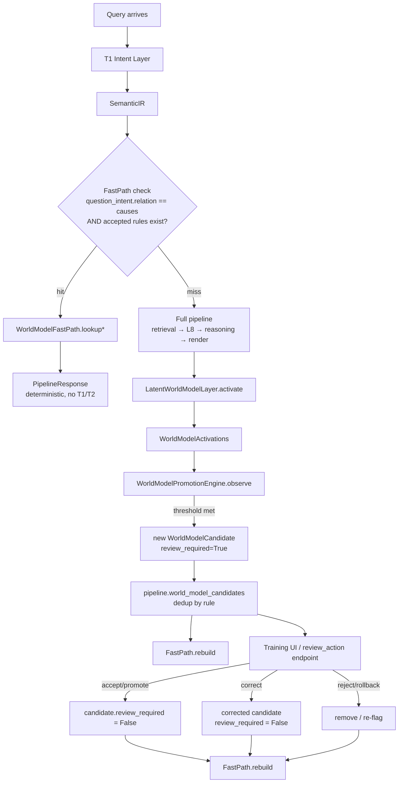
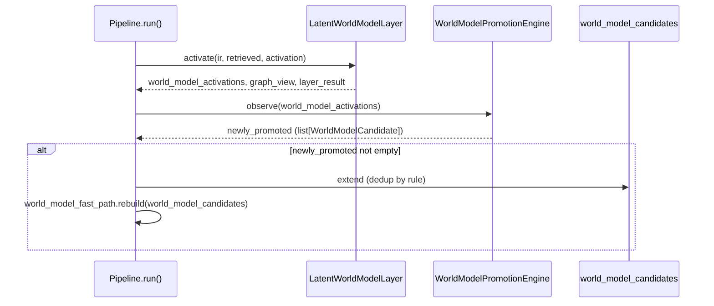
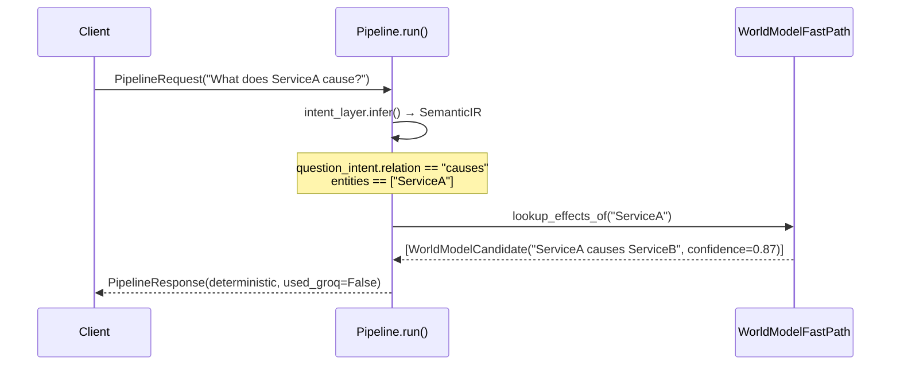
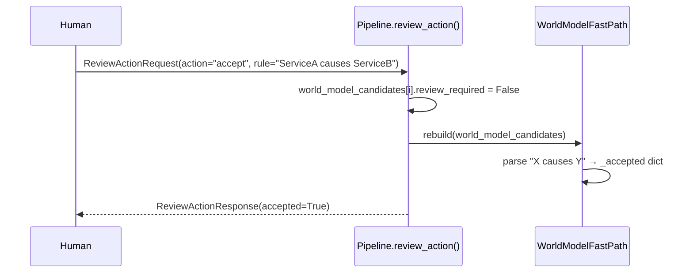

# Design Document: World Model Rule Promotion

## Overview

The JimsAI pipeline already computes causal activations on every query via `LatentWorldModelLayer.activate()` — producing `WorldModelActivation` objects of the form `"X causes Y"` — but immediately discards them. `WorldModelCandidate` (models.py) and `self.world_model_candidates` (pipeline.py) exist as empty scaffolding, and `review_action` is fully wired but has nothing to operate on.

This feature closes that loop: a new `WorldModelPromotionEngine` accumulates causal activations across queries, promotes repeated high-confidence patterns to `WorldModelCandidate(review_required=True)` for human review, and a `WorldModelFastPath` lookup table serves accepted rules as deterministic, model-free answers for matching causal queries. The result is a narrow but genuinely better path for repeated causal lookups: instant, zero-cost, auditable, and fully backwards-compatible with the existing pipeline.

## Architecture



## Sequence Diagrams

### Promotion Flow (new rule crosses threshold)



### Fast-Path Answer Flow (accepted rule matches query)



### Review Lifecycle (human approves a candidate)



## Components and Interfaces

### Component 1: WorldModelPromotionEngine

**Purpose**: Accumulates `WorldModelActivation` observations across queries and promotes rules that cross frequency and confidence thresholds.

**Interface**:
```python
class WorldModelPromotionEngine:
    def observe(self, activations: list[WorldModelActivation]) -> list[WorldModelCandidate]:
        """Record activations from one query's L8 output.
        Returns newly promoted candidates (empty if none crossed threshold).
        Only activations containing ' causes ' are considered.
        """

    def stats(self) -> dict[str, int | float]:
        """Returns {"observed_rules": int, "promoted_rules": int, "avg_confidence": float}.
        Used by AutonomousTrainingAgent to replace the hardcoded 0.73 constant.
        """
```

**Responsibilities**:
- Normalize rule strings (case-insensitive, whitespace-collapsed) for stable dedup keys
- Accumulate per-rule observation counts and confidence sums across multiple `observe()` calls
- Promote a rule exactly once when `count >= JIMS_WM_PROMOTION_MIN_COUNT` (env, default 3) AND `avg_confidence >= JIMS_WM_PROMOTION_MIN_CONF` (env, default 0.6)
- Set `review_required=True` on all promoted candidates — never auto-accept
- Record provenance from `activation.source` fields
- Never call T1/T2/any LLM — fully stateless with respect to model inference

### Component 2: WorldModelFastPath

**Purpose**: Lookup table of accepted (human-reviewed, `review_required=False`) causal rules, rebuilt on-demand. Enables deterministic, model-free answers.

**Interface**:
```python
class WorldModelFastPath:
    def rebuild(self, candidates: list[WorldModelCandidate]) -> None:
        """Rebuild the lookup table from the current candidate list.
        Only candidates with review_required=False are indexed.
        Parses "cause causes effect" via regex.
        """

    def lookup(self, cause: str, effect: str) -> WorldModelCandidate | None:
        """Exact normalized-string lookup for a specific (cause, effect) pair."""

    def lookup_effects_of(self, cause: str) -> list[WorldModelCandidate]:
        """All accepted rules where the cause matches."""

    def lookup_causes_of(self, effect: str) -> list[WorldModelCandidate]:
        """All accepted rules where the effect matches."""
```

**Responsibilities**:
- Parse `"X causes Y"` from rule strings on `rebuild()`
- Normalize cause/effect strings (lowercase, strip) for consistent lookup
- Provide O(1) or O(k) lookups where k is the number of accepted rules per entity
- Return empty results (not errors) when no rules match

### Component 3: Pipeline Wiring (pipeline.py edits)

**Purpose**: Integrates `WorldModelPromotionEngine` and `WorldModelFastPath` into the existing query and review flows with minimal surgical edits.

**Responsibilities**:
- Edit 1 (`__init__`): instantiate `self.world_model_promotion = WorldModelPromotionEngine()` and `self.world_model_fast_path = WorldModelFastPath()` alongside existing layer instantiation
- Edit 2 (after `world_model_layer.activate()`): call `world_model_promotion.observe()`, extend `world_model_candidates` (dedup by rule), and conditionally rebuild fast-path
- Edit 3 (in `review_action()`): call `world_model_fast_path.rebuild()` after every mutating action so the fast-path stays in sync
- Edit 4 (early in `run()`): attempt fast-path lookup after `ir` is available; return early with a deterministic `PipelineResponse` when a match is found, otherwise fall through to the full pipeline unchanged

### Component 4: AutonomousTrainingAgent edit

**Purpose**: Replace the hardcoded `world_model_confidence_avg=0.73` constant with a real value derived from the promotion engine.

**Responsibilities**:
- Call `self.pipeline.world_model_promotion.stats()["avg_confidence"]` inside `_evaluate_system_state()`
- Fall back to `0.0` if no pipeline reference exists (fresh install, no promoted rules yet)

## Data Models

### WorldModelCandidate (existing, models.py line 497)

```python
class WorldModelCandidate(BaseModel):
    rule: str           # "X causes Y" — human-readable causal rule string
    confidence: float   # avg_confidence at promotion time; corrected rules get max(original, 0.9)
    provenance: str     # comma-separated signature IDs that generated this rule
    review_required: bool  # True until human calls review_action(accept/promote/correct)
```

**Validation Rules**:
- `rule` must contain `" causes "` to be indexable by `WorldModelFastPath`
- `confidence` is clamped to `[0.0, 1.0]`
- `review_required=True` is the only valid initial state for promoted candidates

### WorldModelActivation (existing, models.py line 229)

```python
class WorldModelActivation(BaseModel):
    rule: str        # "X causes Y" string
    confidence: float
    source: str      # signature ID that generated the activation
```

### _RuleObservation (internal to WorldModelPromotionEngine)

```python
@dataclass
class _RuleObservation:
    rule: str               # original-cased first-seen rule string
    count: int              # total observations across all queries
    confidence_sum: float   # sum of activation.confidence values
    provenances: set[str]   # all source signature IDs seen for this rule

    @property
    def avg_confidence(self) -> float: ...
```

**Validation Rules**:
- `count >= 1` always (observation created on first sight)
- `provenances` is a set — duplicate source IDs don't inflate counts
- `avg_confidence` is derived, never stored separately

## Key Functions with Formal Specifications

### WorldModelPromotionEngine.observe()

```python
def observe(self, activations: list[WorldModelActivation]) -> list[WorldModelCandidate]
```

**Preconditions**:
- `activations` is a list (may be empty)
- Each activation has non-empty `rule` string and `confidence` in `[0.0, 1.0]`

**Postconditions**:
- Returns only rules that crossed the threshold for the FIRST time in this call
- A rule already in `_promoted_keys` is never returned again, regardless of how many more observations arrive
- Every returned candidate has `review_required=True`
- `observe()` is idempotent for already-promoted rules: repeat calls with the same activations return `[]`

**Loop Invariants**:
- For each processed activation: `_observations[key].count` increases monotonically
- `|_promoted_keys|` is non-decreasing across calls

### WorldModelFastPath.rebuild()

```python
def rebuild(self, candidates: list[WorldModelCandidate]) -> None
```

**Preconditions**:
- `candidates` is the complete current `pipeline.world_model_candidates` list

**Postconditions**:
- `_accepted` contains exactly the subset of candidates where `review_required=False` AND rule matches `"X causes Y"`
- Previous `_accepted` state is fully replaced (not merged)
- Candidates with `review_required=True` are not indexed

**Loop Invariants**:
- All entries in `_accepted` correspond to candidates in the input list with `review_required=False`

### Pipeline fast-path check (inline in `run()`)

**Preconditions**:
- `ir` (SemanticIR) is available from `intent_layer.infer()`
- `ir.scope_constraints["question_intent"]["relation"] == "causes"`
- `ir.scope_constraints["entities"]` is non-empty
- `world_model_fast_path._accepted` is non-empty

**Postconditions**:
- If any `lookup_effects_of(entity)` or `lookup_causes_of(entity)` returns matches: return early with deterministic `PipelineResponse(used_groq=False)`
- If no matches: fall through to the full pipeline unchanged
- The full pipeline is never invoked for a query that hits the fast-path

## Algorithmic Pseudocode

### WorldModelPromotionEngine.observe() Algorithm

```pascal
ALGORITHM observe(activations)
INPUT: activations: list[WorldModelActivation]
OUTPUT: newly_promoted: list[WorldModelCandidate]

BEGIN
  newly_promoted ← []

  FOR each activation IN activations DO
    IF " causes " NOT IN activation.rule THEN
      CONTINUE
    END IF

    key ← normalize_rule(activation.rule)
    obs ← _observations.get(key)

    IF obs IS NULL THEN
      obs ← _RuleObservation(rule=activation.rule, count=0, confidence_sum=0.0)
      _observations[key] ← obs
    END IF

    obs.count ← obs.count + 1
    obs.confidence_sum ← obs.confidence_sum + activation.confidence
    obs.provenances.add(activation.source)

    IF key NOT IN _promoted_keys
       AND obs.count >= _min_count()
       AND obs.avg_confidence >= _min_confidence()
    THEN
      _promoted_keys.add(key)
      candidate ← WorldModelCandidate(
        rule=obs.rule,
        confidence=round(obs.avg_confidence, 4),
        provenance=join(sorted(obs.provenances), ","),
        review_required=True
      )
      newly_promoted.append(candidate)
    END IF
  END FOR

  RETURN newly_promoted
END
```

**Preconditions**: activations is a valid list; each activation.confidence in [0, 1]
**Postconditions**: newly_promoted contains only first-time promotions; all have review_required=True
**Loop Invariants**: _promoted_keys grows monotonically; _observations[key].count increases monotonically

### WorldModelFastPath.rebuild() Algorithm

```pascal
ALGORITHM rebuild(candidates)
INPUT: candidates: list[WorldModelCandidate]
OUTPUT: (void) — mutates _accepted in place

BEGIN
  _accepted.clear()
  pattern ← regex("^(.+?)\s+causes\s+(.+)$", IGNORECASE)

  FOR each candidate IN candidates DO
    IF candidate.review_required = True THEN
      CONTINUE
    END IF

    match ← pattern.match(candidate.rule.strip())
    IF match IS NULL THEN
      CONTINUE
    END IF

    cause ← match.group(1).strip().lower()
    effect ← match.group(2).strip().lower()
    _accepted[(cause, effect)] ← candidate
  END FOR
END
```

**Preconditions**: candidates is the complete current world_model_candidates list
**Postconditions**: _accepted reflects only accepted candidates with valid "X causes Y" rule shape
**Loop Invariants**: _accepted only contains review_required=False candidates

### Pipeline run() Fast-Path Check Algorithm

```pascal
ALGORITHM fast_path_check(ir, request)
INPUT: ir: SemanticIR, request: PipelineRequest
OUTPUT: PipelineResponse | None (None means fall through)

BEGIN
  question_intent ← ir.scope_constraints.get("question_intent", {})
  entities ← [str(e) for e in ir.scope_constraints.get("entities", [])]

  IF question_intent.get("relation") ≠ "causes"
     OR len(entities) < 1
     OR world_model_fast_path._accepted IS EMPTY
  THEN
    RETURN None  // fall through to full pipeline
  END IF

  direction ← question_intent.get("direction", "outgoing")
  fast_matches ← []

  FOR each entity IN entities[:3] DO
    IF direction = "incoming" THEN
      fast_matches.extend(world_model_fast_path.lookup_causes_of(entity))
    ELSE
      fast_matches.extend(world_model_fast_path.lookup_effects_of(entity))
    END IF
  END FOR

  IF fast_matches IS EMPTY THEN
    RETURN None  // fall through to full pipeline
  END IF

  summary_lines ← ["{rule} (confidence {conf:.2f}, verified rule)" for each match in fast_matches[:5]]
  result_sig ← _write_result_signature("world_model_fast_path", "solved", ...)
  RETURN build_pipeline_response(result_sig, fast_matches, used_groq=False)
END
```

**Preconditions**: ir is available; intent_layer.infer() has completed
**Postconditions**: Returns a complete PipelineResponse if a hit, else None; full pipeline never runs on a hit
**Loop Invariants**: fast_matches only contains review_required=False candidates

## Example Usage

```python
# --- Setup (happens once in pipeline.__init__) ---
pipeline.world_model_promotion = WorldModelPromotionEngine()
pipeline.world_model_fast_path = WorldModelFastPath()

# --- Per-query accumulation (pipeline.run(), after L8 activates) ---
world_model_activations, graph_view, wm_layer_result = (
    pipeline.world_model_layer.activate(ir, retrieved, activation)
)
newly_promoted = pipeline.world_model_promotion.observe(world_model_activations)
if newly_promoted:
    existing_rules = {c.rule for c in pipeline.world_model_candidates}
    pipeline.world_model_candidates.extend(
        c for c in newly_promoted if c.rule not in existing_rules
    )
    pipeline.world_model_fast_path.rebuild(pipeline.world_model_candidates)

# --- After human review (pipeline.review_action(), after mutations) ---
# [review_action already mutates world_model_candidates for accept/correct/reject/rollback]
pipeline.world_model_fast_path.rebuild(pipeline.world_model_candidates)

# --- Fast-path query answer (pipeline.run(), after ir is available) ---
question_intent = ir.scope_constraints.get("question_intent", {})
entities = [str(e) for e in ir.scope_constraints.get("entities", [])]
if (
    isinstance(question_intent, dict)
    and question_intent.get("relation") == "causes"
    and len(entities) >= 1
    and pipeline.world_model_fast_path._accepted
):
    fast_matches = pipeline.world_model_fast_path.lookup_effects_of(entities[0])
    if fast_matches:
        # Return deterministic answer without invoking full pipeline
        ...

# --- AutonomousTrainingAgent: replace hardcoded 0.73 ---
world_model_confidence_avg = (
    self.pipeline.world_model_promotion.stats()["avg_confidence"]
    if getattr(self, "pipeline", None) is not None
    else 0.0
)
```

## Correctness Properties

*A property is a characteristic or behavior that should hold true across all valid executions of a system — essentially, a formal statement about what the system should do. Properties serve as the bridge between human-readable specifications and machine-verifiable correctness guarantees.*

### Property 1: Promotion threshold gate

*For any* sequence of `observe()` calls with activations for a given rule, if the total observation count is below `JIMS_WM_PROMOTION_MIN_COUNT` OR the average confidence is below `JIMS_WM_PROMOTION_MIN_CONF`, then no `WorldModelCandidate` for that rule is ever returned by `observe()`.

**Validates: Requirements 3.1, 3.2, 3.3**

### Property 2: Promotion happens exactly once per rule, always with review_required=True

*For any* rule string and any sequence of `observe()` calls, that rule appears in the combined return values of all `observe()` calls at most once — and when it does appear, its `review_required` field is `True`.

**Validates: Requirements 3.4, 3.5**

### Property 3: Causal-rule filter — only " causes " activations are processed

*For any* list of `WorldModelActivation` objects passed to `observe()`, all activations whose `rule` does not contain the substring `" causes "` have no effect on the Promotion_Engine's internal state (observation counts, confidence sums, promoted keys).

**Validates: Requirements 2.1, 2.3**

### Property 4: Normalization dedup — case and whitespace variants are the same rule

*For any* two rule strings that are identical after case-folding and whitespace collapsing, observations of both strings increment the same internal counter and produce at most one combined promotion.

**Validates: Requirements 2.4**

### Property 5: Fast-path contains only accepted rules after rebuild

*For any* call to `WorldModelFastPath.rebuild(candidates)`, every result returned by `lookup()`, `lookup_effects_of()`, or `lookup_causes_of()` corresponds to a candidate from the input list with `review_required=False` whose rule matches `"<cause> causes <effect>"`. Candidates with `review_required=True` are never returned.

**Validates: Requirements 4.2, 4.3, 10.1**

### Property 6: Fast-path lookup completeness and correctness

*For any* list of accepted candidates passed to `rebuild()`, `lookup_effects_of(cause)` returns all and only the candidates in that list whose parsed cause matches the query string (after normalization), and `lookup_causes_of(effect)` returns all and only candidates whose parsed effect matches. No candidate is silently omitted or spuriously included.

**Validates: Requirements 4.4, 4.5, 4.6**

### Property 7: Non-causal queries bypass the fast-path

*For any* `PipelineRequest` that produces a `SemanticIR` where `question_intent.relation != "causes"`, the Pipeline's fast-path block is never entered — the query proceeds through the full retrieval and reasoning pipeline.

**Validates: Requirements 8.6**

### Property 8: Fast-path hits produce deterministic, model-free responses

*For any* causal query where `world_model_fast_path` returns at least one matching accepted candidate, the `PipelineResponse` has `used_groq=False` and contains the matched rule data — and the full retrieval/reasoning/render layers are not invoked for that query.

**Validates: Requirements 8.1, 8.2, 8.4, 8.5**

### Property 9: world_model_candidates deduplication

*For any* sequence of queries that produce the same causal rule across multiple promotion events, the rule appears in `pipeline.world_model_candidates` at most once regardless of how many times it is promoted.

**Validates: Requirements 6.2**

### Property 10: world_model_confidence_avg reflects actual state, not a constant

*For any* two pipeline states with different sets of promoted rules (or no rules vs. some rules), `pipeline.world_model_promotion.stats()["avg_confidence"]` returns values that differ — demonstrating it is a computed measurement, not a hardcoded constant.

**Validates: Requirements 9.1, 9.3**

## Error Handling

### Scenario 1: No activations cross threshold (most common case)

**Condition**: `observe()` returns an empty list because no rules have accumulated enough observations.
**Response**: `world_model_candidates` is unchanged; `world_model_fast_path` is not rebuilt (no-op).
**Recovery**: Normal pipeline behavior continues; zero visible impact.

### Scenario 2: Fast-path lookup finds no match

**Condition**: Query has `question_intent.relation == "causes"` but no accepted rule matches the extracted entities.
**Response**: Fast-path returns `None`; the query falls through to the full pipeline.
**Recovery**: Full pipeline runs exactly as it did before this feature existed. Behavior is identical to pre-feature baseline.

### Scenario 3: Malformed rule string in candidate

**Condition**: A `WorldModelCandidate.rule` does not contain `" causes "` (e.g., was manually inserted or corrupted).
**Response**: `WorldModelFastPath.rebuild()` skips the candidate silently (regex match fails).
**Recovery**: The candidate remains in `world_model_candidates` for audit but is not indexed in the fast-path.

### Scenario 4: `review_action` target not found in `world_model_candidates`

**Condition**: `review_action` is called for a rule that was removed or was never in the in-memory list (e.g., pipeline restarted, or persistent fallback path taken).
**Response**: The existing `production.review_world_model_candidate()` fallback path is taken (already implemented). `world_model_fast_path.rebuild()` is called regardless, ensuring the fast-path is consistent with the current in-memory state.
**Recovery**: Persistent storage is updated; audit event is written.

### Scenario 5: `AutonomousTrainingAgent` has no pipeline reference

**Condition**: `getattr(self, "pipeline", None)` is `None` on the agent.
**Response**: `world_model_confidence_avg` is set to `0.0`.
**Recovery**: Downstream gap detection uses `0.0`, which is conservative and safe (will flag a gap rather than silently ignore one).

## Testing Strategy

### Unit Testing Approach

Unit tests cover the two new classes in isolation — no pipeline, no graph, no LLM:

- `WorldModelPromotionEngine`: threshold logic, dedup, confidence floor, env var overrides
- `WorldModelFastPath`: rebuild from mixed accepted/pending candidates, all three lookup methods, empty-state safety

### Property-Based Testing Approach

**Property Test Library**: `hypothesis`

Property tests cover the universal invariants:

- **Promotion exactly-once**: generate arbitrary sequences of activations for the same rule; assert promoted at most once
- **Threshold correctness**: for any count < `min_count` or avg_confidence < `min_conf`, assert no promotion
- **Fast-path accepted-only**: after `rebuild()` with arbitrary mixed candidates, assert every lookup result has `review_required=False`
- **Non-causal query bypass**: generate queries without `"causes"` relation; assert fast-path never fires

### Integration Testing Approach

Integration tests use a real `JimsAIPipeline` instance:

- **Three-query promotion**: ingest three queries that each produce a causal activation; assert candidate appears in `world_model_candidates`
- **Review lifecycle**: accept a candidate; assert `review_required=False` and `fast_path.lookup()` returns it
- **Fast-path end-to-end**: after acceptance, send a matching causal query; assert `PipelineResponse.used_groq=False` and response contains the rule
- **Regression — non-match falls through**: send a causal query for unknown entities; assert full pipeline ran (response shape unchanged from baseline)

## Performance Considerations

The fast-path is the primary performance benefit. For repeated, human-approved causal queries:
- `lookup_effects_of()` is O(k) where k is the number of accepted rules per cause entity — expected to be very small (< 20 in typical deployments)
- No model inference, no retrieval, no graph traversal for fast-path hits
- `rebuild()` is O(n) where n is `len(world_model_candidates)` — called only on promotion events and after `review_action` (both infrequent)

The accumulation path (`observe()`) adds negligible overhead to each query: it iterates the already-produced `world_model_activations` list (typically 0-10 items) with O(1) dict operations.

## Security Considerations

- `review_required=True` is non-negotiable on promotion — no auto-accept path exists
- All accepted rules have a provenance trail: source signature IDs + a review audit event in `event_store`
- The fast-path uses exact normalized-string matching only — no embedding similarity, no fuzzy matching that could be manipulated via adversarial inputs
- Environment variables (`JIMS_WM_PROMOTION_MIN_COUNT`, `JIMS_WM_PROMOTION_MIN_CONF`) affect promotion thresholds but not acceptance; only a human `review_action` call promotes `review_required` to `False`

## Dependencies

- `prototype/jimsai/models.py` — `WorldModelCandidate`, `WorldModelActivation` (existing, no changes)
- `prototype/jimsai/runtime_layers.py` — `LatentWorldModelLayer` (existing, no changes)
- `prototype/jimsai/pipeline.py` — four targeted edits (wiring only)
- `prototype/jimsai/autonomous_training_agent.py` — one edit to replace hardcoded constant
- Standard library: `os`, `re`, `collections.defaultdict`, `dataclasses`
- No new third-party dependencies
