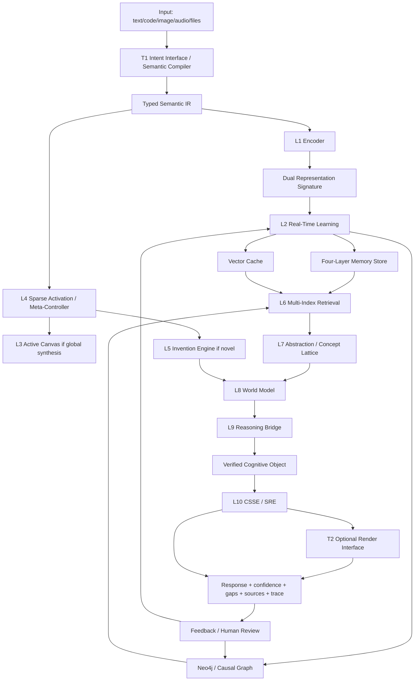
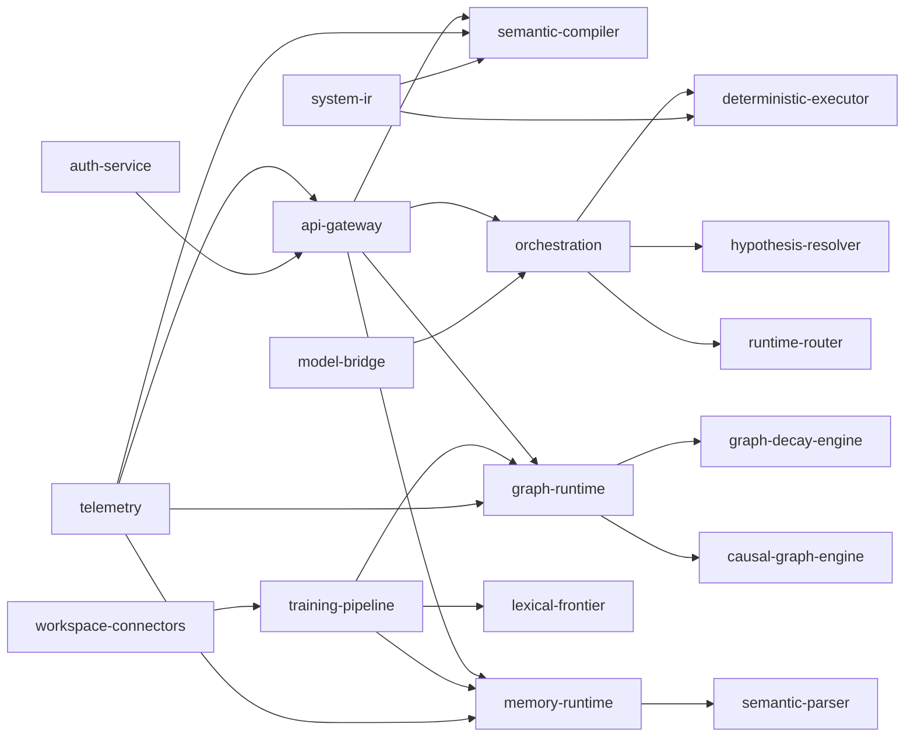

# Dependency Graph

```mermaid
graph TD
  Input[Input: text/code/image/audio/files] --> T1[T1 Intent Interface / Semantic Compiler]
  T1 --> IR[Typed Semantic IR]
  IR --> L1[L1 Encoder]
  L1 --> Sig[Dual Representation Signature]
  Sig --> L2[L2 Real-Time Learning]
  L2 --> Memory[Four-Layer Memory Store]
  L2 --> Graph[Neo4j / Causal Graph]
  L2 --> Vector[Vector Cache]
  IR --> L4[L4 Sparse Activation / Meta-Controller]
  L4 --> L3[L3 Active Canvas if global synthesis]
  L4 --> L5[L5 Invention Engine if novel]
  Memory --> L6[L6 Multi-Index Retrieval]
  Graph --> L6
  Vector --> L6
  L6 --> L7[L7 Abstraction / Concept Lattice]
  L7 --> L8[L8 World Model]
  L5 --> L8
  L8 --> L9[L9 Reasoning Bridge]
  L9 --> VCO[Verified Cognitive Object]
  VCO --> L10[L10 CSSE / SRE]
  L10 --> T2[T2 Optional Render Interface]
  T2 --> Output[Response + confidence + gaps + sources + trace]
  L10 --> Output
  Output --> Feedback[Feedback / Human Review]
  Feedback --> L2
  Feedback --> Graph
```

## Service Dependencies

```mermaid
graph LR
  APIGW[api-gateway] --> SC[semantic-compiler]
  APIGW --> MR[memory-runtime]
  APIGW --> GR[graph-runtime]
  APIGW --> ORCH[orchestration]
  ORCH --> RR[runtime-router]
  ORCH --> HR[hypothesis-resolver]
  ORCH --> DE[deterministic-executor]
  MR --> SP[semantic-parser]
  GR --> CG[causal-graph-engine]
  GR --> GDE[graph-decay-engine]
  TP[training-pipeline] --> MR
  TP --> GR
  TP --> LF[lexical-frontier]
  MB[model-bridge] --> ORCH
  TEL[telemetry] --> APIGW
  TEL --> SC
  TEL --> GR
  TEL --> MR
  AUTH[auth-service] --> APIGW
  WC[workspace-connectors] --> TP
  SIR[system-ir] --> SC
  SIR --> DE
```
